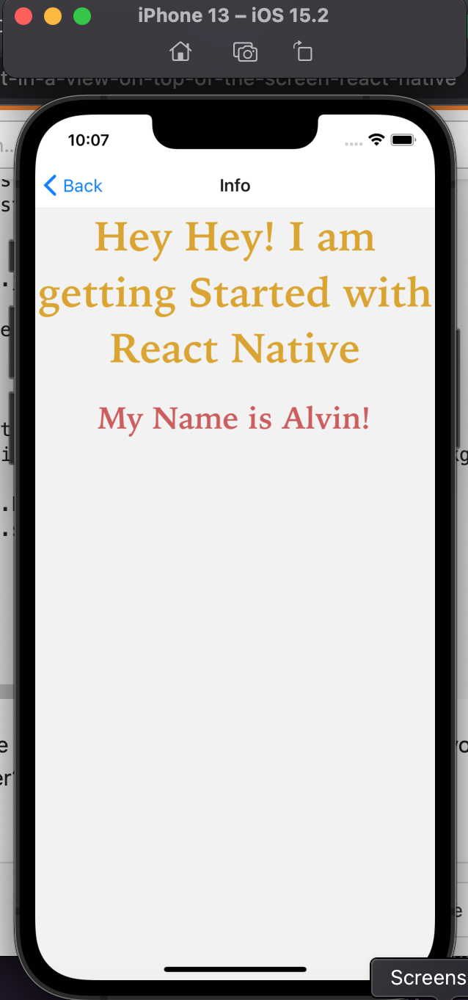

 

<h3 align="center">Learning Journal 11 April 2022</h3>

<!-- TABLE OF CONTENTS -->

  
Table of Contents

  <ul>
    <li><a href="#what-did-i-learn-today">What did I learn today?</a></li>
    <li><a href="#any-issues-i-encounter">Any issues I encounter?</a></li>
    <li><a href="#acknowledgments">Acknowledgments</a></li>
    <li><a href="#resource-links">Resource Links</a></li>
      </ul>
     

<!-- ABOUT THE PROJECT -->
## What did I learn today? ##
----
### React Native ###
1. **JSX**
  - JSX in my opinion, gives developer the flexibility as it resembles the hybrid of HTML and JS coding manner.
  - I went to see in Babel.JS if I were to code the JSX codes in pure JS language, it will be longer and won't be as easy to read and maintain.

2. **React Component File**
  - A React Component file will consist of 4 parts
    - First: Libraries to be imported
    - Second: Component -> it is a function that returns a JSX
    - Third: StyleSheet to style the component
    - Fourth: Export the component so we could import in another component in our project!
    - I like how the results would show instantaneously after you save the codes.

3. **React Native Core Components**
  1. `View`
  2. `Text`
  3. `Image`
  4. `ScrollView`
  5. `TextInput`

4. **Challenge Practise**
   

## Any issues I encounter? ##
----
1. Initially I encountered some issue while creating two blocks of text, but later on I understand that I have to use a View tab to wrap up the two Text components.

2. I am interested in the React Native Animation component 

<!-- ACKNOWLEDGMENTS -->
## Acknowledgments ##
----
* [Anya](https://github.com/huanganya/react-native-starter)
* Janan
* Russell
* Brian
* Othneil Drew for this readme template
* [Nader Dabit for the fonts](https://github.com/react-native-training/react-native-fonts)

<!-- Resource Links -->
## Resource Links ##
----
* [Day 6: React Native Training Course](https://docs.google.com/document/d/1fa032pQuv8I8gXU7pqMd20sJfbnJZnPqVqdSlo9_v8s/edit#)

* [Understand React Native with Hooks, Context, and React Navigation.](https://nlbsg.udemy.com/course/the-complete-react-native-and-redux-course/learn/lecture/15706480#overview)

* [Codecademy](https://www.codecademy.com/learn/learn-typescript)

* [Understanding TypeScript - 2022 Edition](https://nlbsg.udemy.com/course/understanding-typescript/learn/lecture/16888226#overview)

* [React Native Style](https://reactnative.dev/docs/style)

* [React JSX](https://www.w3schools.com/react/react_jsx.asp)

(<a href="#top">back to top</a>)

