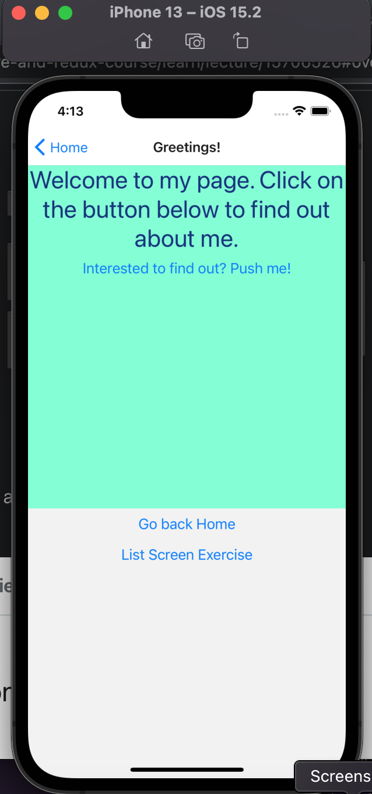
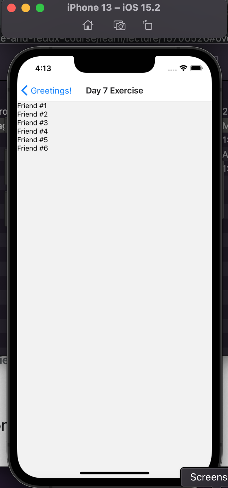
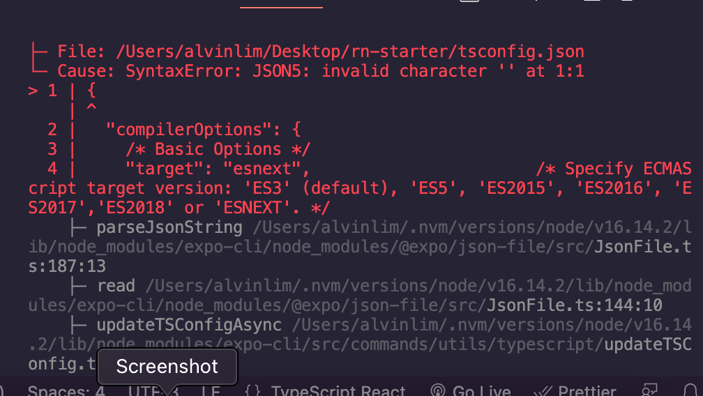

 

<h3 align="center">Learning Journal 12 April 2022</h3>

<!-- TABLE OF CONTENTS -->

  
Table of Contents

  <ul>
    <li><a href="#what-did-i-learn-today">What did I learn today?</a></li>
    <li><a href="#my-component-in-react-native-starter-project">My Component in react-native-starter project</a></li>
    <li><a href="#any-issues-i-encounter">Any issues I encounter?</a></li>
    <li><a href="#acknowledgments">Acknowledgments</a></li>
    <li><a href="#resource-links">Resource Links</a></li>
      </ul>
     

<!-- ABOUT THE PROJECT -->
## What did I learn today? ##
----
### React Native ###
  - After trying to create my own component screen into the project starter package provided by Anya, these are my realisations:

    1. the different screens components are like our HTML pages for web-apps then the styles.ts are the React Native's CSS

    2. You have to import your component into the AppStack and create a portion of the stack for your component so that it will show up when you click on the link to your component

    3. The React Native is very modular whereby after your import you get to call the required function or variable as and when you need it.

  - **FlatList Element**
    - it turns an array into a list of elements
    
    - it is like mapping an array of data into a list
    
    - the key will help to map the array item with what is shown on screen
    
    - Prop:
      - data => where do you get your data from (i.e. arrayname)
      - keyExtractor => to extract an item unique key at specified index.
      - renderItem => takes the data stated above and then map it into a list.

    - the key has to be:
      1. Unique 
      2. string
    - 
## My Component in react-native-starter project ##
----

  - **First Component Page**

    
  
  - **Second Component Page**
    
    

## Any issues I encounter? ##
----
  - I have encountered the issue of putting two View components inside my component.
    - I realise I have to wrap with a parent View tab.
  
  - The difference of .tsx and .ts 
    - .tsx file can contain JSX expression. .ts file are usually in storing helper function.

  - While trying to convert the udemy project into TypeScript, I have encountered an issue with the tsconfig.json. --> will try to research more on this.

  

<!-- ACKNOWLEDGMENTS -->
## Acknowledgments ##
----
* [Anya](https://github.com/huanganya/react-native-starter)
* Janan
* Russell
* Brian
* Othneil Drew for this readme template

<!-- Resource Links -->
## Resource Links ##
----
* [Day 6: React Native Training Course](https://docs.google.com/document/d/1fa032pQuv8I8gXU7pqMd20sJfbnJZnPqVqdSlo9_v8s/edit#)

* [Day 7: React Native Training Course](https://docs.google.com/document/d/1z9KJrfoGPsejG670rZVt088W6VCt1FyQbjMSf9n86aA/edit)

* [Understand React Native with Hooks, Context, and React Navigation.](https://nlbsg.udemy.com/course/the-complete-react-native-and-redux-course/learn/lecture/15706480#overview)

* [Codecademy](https://www.codecademy.com/learn/learn-typescript)

* [Understanding TypeScript - 2022 Edition](https://nlbsg.udemy.com/course/understanding-typescript/learn/lecture/16888226#overview)

* [React Native Style](https://reactnative.dev/docs/style)

* [React JSX](https://www.w3schools.com/react/react_jsx.asp)

* [What is the difference between .ts and .tsx extensions](https://stackoverflow.com/questions/56871384/what-is-the-difference-between-ts-and-tsx-extensions-both-are-used-as-extensi)

(<a href="#top">back to top</a>)

