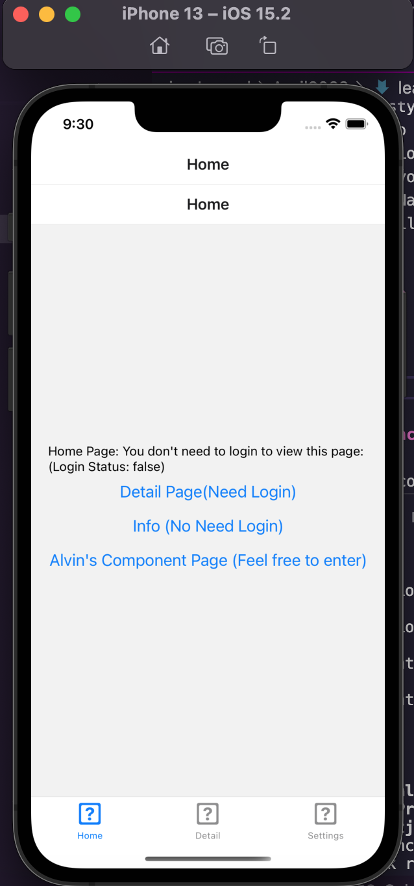
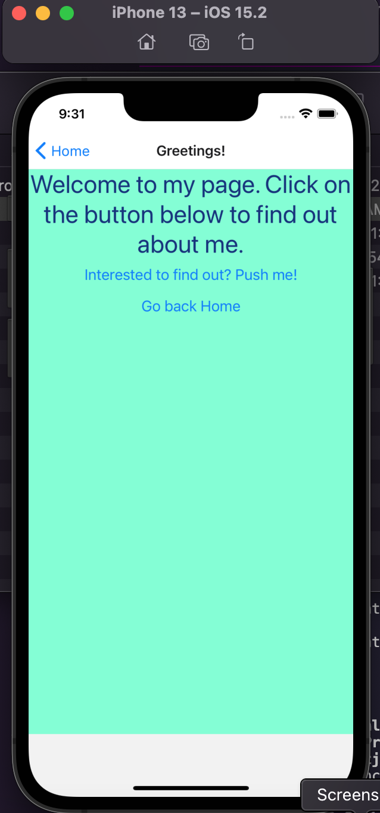

 

<h3 align="center">Learning Journal 12 April 2022</h3>

<!-- TABLE OF CONTENTS -->

  
Table of Contents

  <ul>
    <li><a href="#what-did-i-learn-today">What did I learn today?</a></li>
    <li><a href="#any-issues-i-encounter">Any issues I encounter?</a></li>
    <li><a href="#acknowledgments">Acknowledgments</a></li>
    <li><a href="#resource-links">Resource Links</a></li>
      </ul>
     

<!-- ABOUT THE PROJECT -->
## What did I learn today? ##
----
### React Native ###
  - After trying to create my own component screen into the project starter package provided by Anya, these are my realisations:
    1. the different screens components are like our HTML pages for web-apps
    2. then the styles.ts are the React Native's CSS
    3. You have to import your component into the AppStack and create a portion of the stack for your component so that it will show up when you click on the link to your component
    4. The React Native is very modular whereby after your import you get to call the required function or variable as and when you need it.

## My Component in react-native-starter project ##

 - **Home Page**

    

  - **Component Page**

    

## Any issues I encounter? ##
----
1. I have encountered the issue of putting two View components inside my component and I realise I have to wrap with a parent View tab. -> **Resolved**

<!-- ACKNOWLEDGMENTS -->
## Acknowledgments ##
----
* [Anya](https://github.com/huanganya/react-native-starter)
* Janan
* Russell
* Brian
* Othneil Drew for this readme template

<!-- Resource Links -->
## Resource Links ##
----
* [Day 6: React Native Training Course](https://docs.google.com/document/d/1fa032pQuv8I8gXU7pqMd20sJfbnJZnPqVqdSlo9_v8s/edit#)

* [Understand React Native with Hooks, Context, and React Navigation.](https://nlbsg.udemy.com/course/the-complete-react-native-and-redux-course/learn/lecture/15706480#overview)

* [Codecademy](https://www.codecademy.com/learn/learn-typescript)

* [Understanding TypeScript - 2022 Edition](https://nlbsg.udemy.com/course/understanding-typescript/learn/lecture/16888226#overview)

* [React Native Style](https://reactnative.dev/docs/style)

* [React JSX](https://www.w3schools.com/react/react_jsx.asp)

(<a href="#top">back to top</a>)

