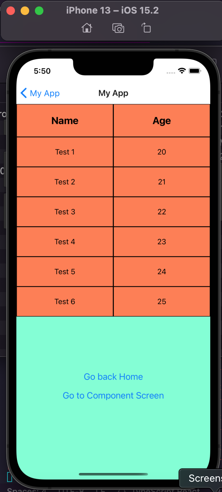
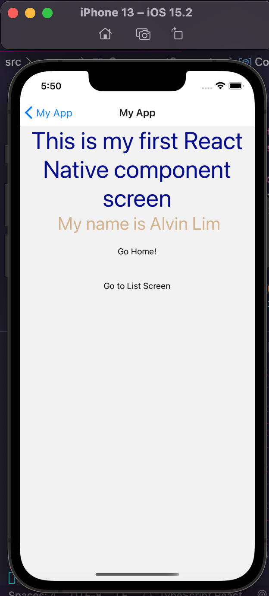
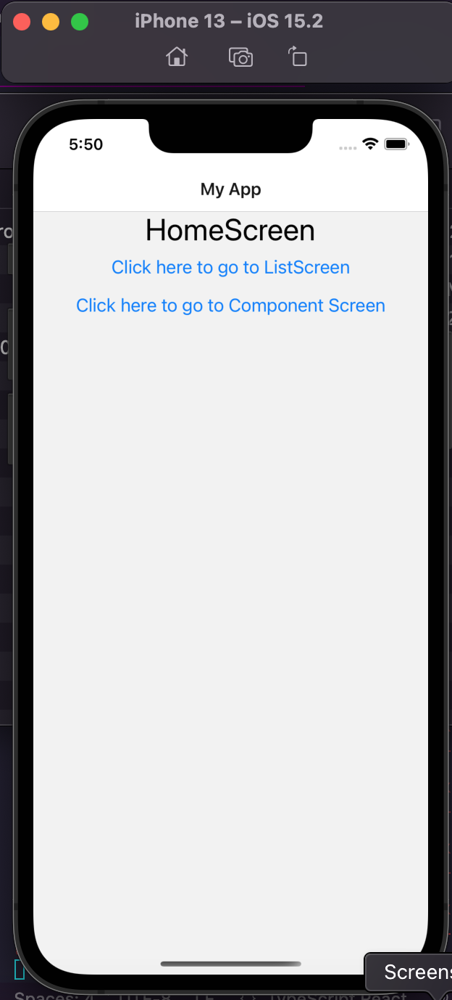

 

<h3 align="center">Learning Journal 12 April 2022</h3>

<!-- TABLE OF CONTENTS -->

  
Table of Contents

  <ul>
    <li><a href="#what-did-i-learn-today">What did I learn today?</a></li>
    <li><a href="#snippets">Snippets</a></li>
    <li><a href="#any-issues-i-encounter">Any issues I encounter?</a></li>
    <li><a href="#acknowledgments">Acknowledgments</a></li>
    <li><a href="#resource-links">Resource Links</a></li>
      </ul>
     

<!-- ABOUT THE PROJECT -->
## What did I learn today? ##
----
<!-- Type what you learnt here -->
### React Native ###
  - `TouchableOpacity`
    - TouchableOpacity is a wrapper to handle touches so as to provide a touch effect on element wrapped within it.
    - With no customisation, it will just look like a string of text. When you click on the element, then you will see the change in opacity of the wrapped element.
    - you will have to provide some level of styling in order for it to look like a button 
    - this would be good if you have to provide heavy customisation to your buttons
    - also, despite opacity changed when you click, you will have to add an event handler for press actions to be taken.

  - `Button`
    - Button provide very minimal level of customisation. 
    - you are able yo use it 'out of the box'
    - you can always build a button or visit the community for their source code of their custom buttons: https://js.coach/?search=button&collection=React+Native

  - `Pick`
    - Helper function in TypeScript to pick the properties based on the condition. (i.e. from T **pick** the set of properties that are in union type K)

  - `flex`
    - The concept of flex in the styling is very important which I will need to practise more

  - `navigation`
    - it helps to assign a navigation event to the button

### Time Management ###
  - TimeBoxing: 
    - To allocate a set amount of time for an issue so that you can focus on priorities taskings and not be held up by 1 bug/issues!
    
## Snippets ##
----
<!-- You can attach snippets of your end product here -->
  
  - **Show FlatList as Table**
    
    
  
  - **Component Screen using Touch Opacity**

    

  - **Home Screens using the Button**

    

## Any issues I encounter? ##
----
<!-- Type Your Issues Faced today Here -->
  - Special thanks to Willy for helping me in coming up with the code to present the FlatList in the form of a table.

  - I will need to practise more on the styling to achieve the effects i want and to familiarise with the different properties.

<!-- ACKNOWLEDGMENTS -->
## Acknowledgments ##
----
* Janan
* [Anya](https://github.com/huanganya/react-native-starter)
* [Willy](https://github.com/WillyWangwl) 
* Othneil Drew for this ReadMe template

<!-- Resource Links -->
## Resource Links ##
----
* [Day 8: React Native Training Course](https://docs.google.com/document/d/1Ae2L7WqB_7fwU7dcnm8JtFNdTtyrRr8flq5aGFCDsUU/edit)

* [Understand React Native with Hooks, Context, and React Navigation.](https://nlbsg.udemy.com/course/the-complete-react-native-and-redux-course/learn/lecture/15706480#overview)

* [Codecademy](https://www.codecademy.com/learn/learn-typescript)

* [TypeScript 2.1](https://www.typescriptlang.org/docs/handbook/release-notes/typescript-2-1.html)

* [Using Buttons in React Native](https://kmarks2013.medium.com/using-buttons-in-react-native-eab86155f56)

* [JS.coach](https://js.coach/?search=button&collection=React+Native)

(<a href="#top">back to top</a>)

