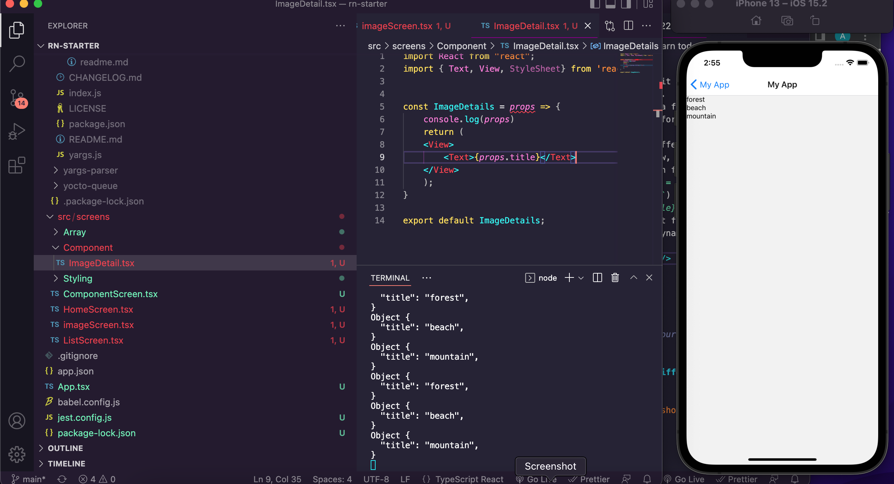
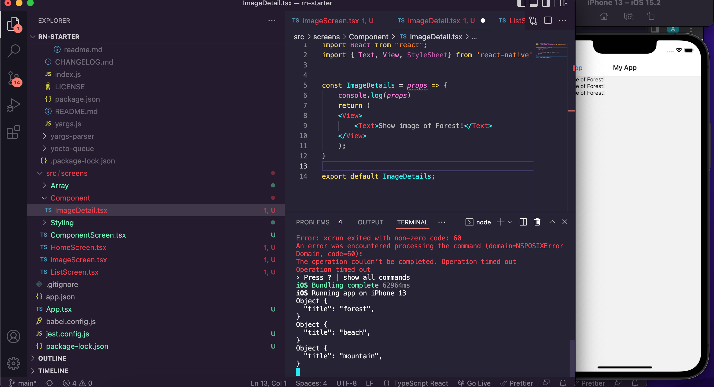
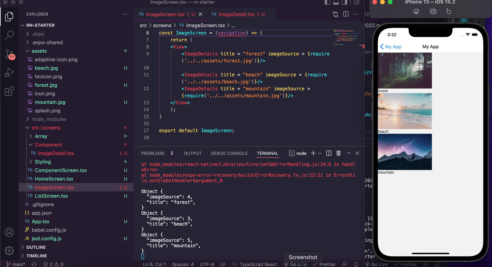
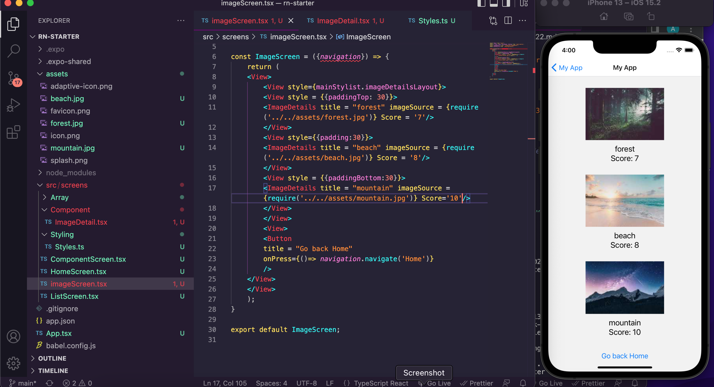

 

<h3 align="center">Learning Journal 14 April 2022</h3>

<!-- TABLE OF CONTENTS -->

  
Table of Contents

  <ul>
    <li><a href="#what-did-i-learn-today">What did I learn today?</a></li>
    <li><a href="#snippets">Snippets</a></li>
    <li><a href="#any-issues-i-encounter">Any issues I encounter?</a></li>
    <li><a href="#acknowledgments">Acknowledgments</a></li>
    <li><a href="#resource-links">Resource Links</a></li>
      </ul>
     

<!-- ABOUT THE PROJECT -->
## What did I learn today? ##
----
<!-- Type what you learnt here -->
### React Native ###
  - **Reusable Components**
    - this features is useful as it allows you to reuse the props when required.
    - the main idea is to create a folder of all the components you will need for your app and call it into your screens.
    - In order to make it show different things based on what you want to show, you will have to add in a prop in the screen file. 
    - the attributes to the ImageDetail tag (e.g. `title` or `imageSource`) are based on what you want to call it. 
      - it allows you to set a unique identifier to your components for the pages so that you can display different stuff using the same components.
      - Do name it in a way such that fellow developers could easily understand.
      - (e.g. `<ImageDetail title = 'somethingYouWantToShow' />`)
    - we could insert `{props.title}` as the return value for the component function so that the result will appear dynamically.

      
    
    - the **assets** folder is where you can put in image which wont't change and you wish to use it for your project.

    - the `required` statement for the image source tag is for us to provide a path to the image.

## Snippets ##
----
<!-- You can attach snippets of your end product here -->
  
  - **Showing that the props is different for the three components**
  
    
  
  - **displaying images based on what we want to display**

    

  - **Practise Exercise**

    

## Any issues I encounter? ##
----
<!-- Type Your Issues Faced today Here -->

<!-- ACKNOWLEDGMENTS -->
## Acknowledgments ##
----
* Janan
* [Anya](https://github.com/huanganya/react-native-starter)
* Othneil Drew for this ReadMe template

<!-- Resource Links -->
## Resource Links ##
----
* [Day 9: React Native Training Course](https://docs.google.com/document/d/192rnWp4581_NDErzvnU-9kithr9-D-6_YbJr0jmPdOs/edit#heading=h.sjc7nb6il2di)

* [Understand React Native with Hooks, Context, and React Navigation.](https://nlbsg.udemy.com/course/the-complete-react-native-and-redux-course/learn/lecture/15706480#overview)

* [Codecademy](https://www.codecademy.com/learn/learn-typescript)

(<a href="#top">back to top</a>)

