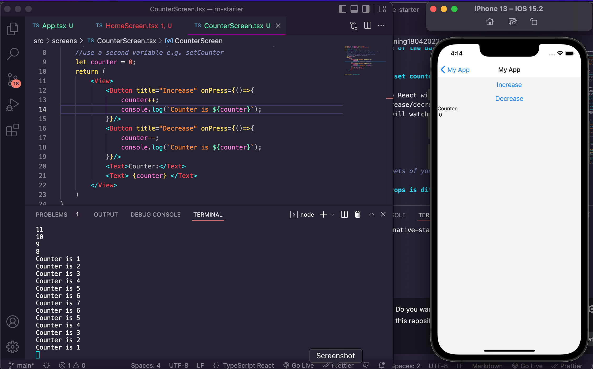
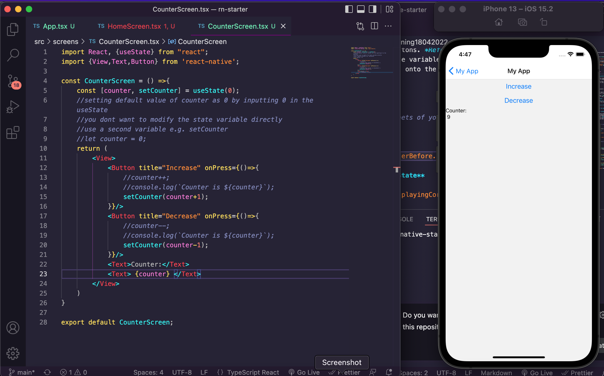

 

<h3 align="center">Learning Journal 18 April 2022</h3>

<!-- TABLE OF CONTENTS -->

  
Table of Contents

  <ul>
    <li><a href="#what-did-i-learn-today">What did I learn today?</a></li>
    <li><a href="#snippets">Snippets</a></li>
    <li><a href="#any-issues-i-encounter">Any issues I encounter?</a></li>
    <li><a href="#acknowledgments">Acknowledgments</a></li>
    <li><a href="#resource-links">Resource Links</a></li>
      </ul>
     

<!-- ABOUT THE PROJECT -->
## What did I learn today? ##
----
<!-- Type what you learnt here -->
### React Native ###
  1. **Recap on Reusable Components**
    - Passing the props as the argument in the component details page to allow the components to show dynamically onto the screens page.
    
    - Remember to also add in the require statement for the image source path in the prop in the screen page. 
  
  2. **States Management**
      - **States vs Props**
        - **Props**

          - Pass data from parent (Screen) to child (Components)

        - **States**
          - Track a Piece of data that change over time. When the data changes, our app will re-render.

          - Remember to always `import {useState} from "react"` whenever you need to set a new state variable.
      
      - **Example: Counter app**
        
        - **What piece of data is changing in the app**
          - The counts each time you press the Increase or Decrease button
        
        - **What type of data is it?**
          - It is a number
        
        - **Default Value of the data**
          - 0

      - **Why do you not set counter as 0 and do counter ++ or --?**

        - This is because React will not reflect the changes when you click on the increase/decrease button. But in fact, behind the scene, the counter variable is actually changing based on the clicks on the buttons. *Refer to Screenshot: Counter Before* By using the State variable, React will watch the changes for us and reflect it onto the screens.    

        - **Never** modify the State variable directly

        - You can name the state variable anything you want as long as it is easily understandable what is it for 
      
## Snippets ##
----
<!-- You can attach snippets of your end product here -->
  
  - **Counter: Before**
  
    
  
  - **Counter App using State**

    

## Any issues I encounter? ##
----
<!-- Type Your Issues Faced today Here -->

<!-- ACKNOWLEDGMENTS -->
## Acknowledgments ##
----
* [Anya](https://github.com/huanganya/react-native-starter)
* Janan
* Othneil Drew for this ReadMe template

<!-- Resource Links -->
## Resource Links ##
----
* [Day 10: React Native Training Course](https://docs.google.com/document/d/1qo1kA0VyDVUT-HQd4CsTLzU00hcaKdTnuog4xts1gz4/edit)

* [Understand React Native with Hooks, Context, and React Navigation.](https://nlbsg.udemy.com/course/the-complete-react-native-and-redux-course/learn/lecture/15706480#overview)

* [Why Should we not update the state directly in React](https://www.bestinterviewquestion.com/question/why-should-we-not-update-the-state-directly-in-react-qxzqu5592op)

(<a href="#top">back to top</a>)

