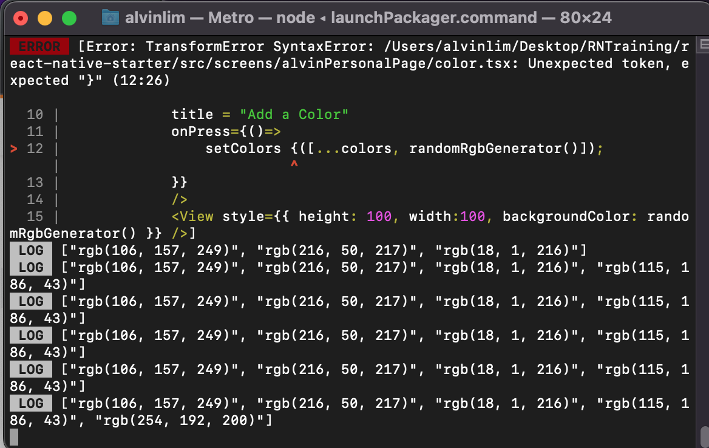
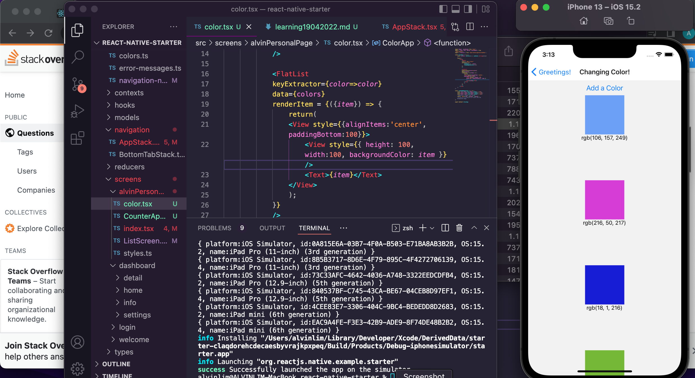
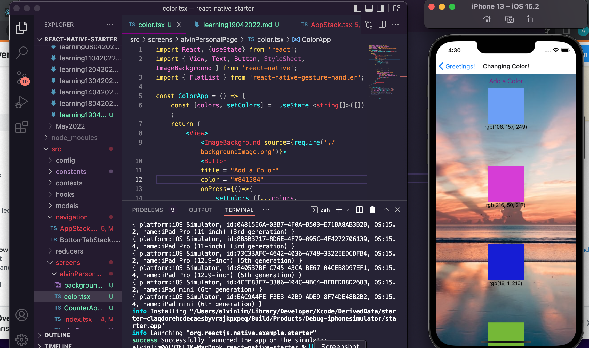

 

<h3 align="center">Learning Journal 19 April 2022</h3>

<!-- TABLE OF CONTENTS -->

  
Table of Contents

  <ul>
    <li><a href="#what-did-i-learn-today">What did I learn today?</a></li>
    <li><a href="#snippets">Snippets</a></li>
    <li><a href="#any-issues-i-encounter">Any issues I encounter?</a></li>
    <li><a href="#acknowledgments">Acknowledgments</a></li>
    <li><a href="#resource-links">Resource Links</a></li>
      </ul>
     

<!-- ABOUT THE PROJECT -->
## What did I learn today? ##
----
<!-- Type what you learnt here -->
### React Native ###
  1. **Side Readings on Hooks**
    - Hooks have 3 rules:
      - Hooks can only be called within the React function component
      - Hooks can only be called at the top level of a component
      - Hooks cannot be conditional
      - We can also create our own custom hooks for reusability in several components. 
    - `useState`
      - The `useState` hook allow us to track state in a function component.
      - It makes the value to be reactive to changes and display onto the screen whenever we want!
      - State is referring to data or properties that need to be tracked in the app. (e.g. for counter app, it will be the counter that needs to be tracked) 
      - `useState` accepts an initial state / default value (e.g. `useState(0)`) and return 2 values:
        - current state (e.g. `counter`)
        - function that updates the state (e.g. `setCounter`).

  - State is like a function's local scope in JS.
  - Components on the other hand is similar to a function in JS.
  - Props will be similar to passing an argument into a function in JS.

  2. **States Management**
      - **Example: Color app**
        
        - **What piece of data is changing in the app**
          - The Colors
        
        - **What type of data is it?**
          - Array of String
        
        - **Default Value of the data**
          - can set it as an empty array, `useState([])`

## Snippets ##
----
<!-- You can attach snippets of your end product here -->
  
  - **Console showing the app taking in data when clicking add color button**
  
    
  
  - **Color App using State**

    
  
  - **Add Image Background**

    

## Any issues I encounter? ##
----
<!-- Type Your Issues Faced today Here -->
  1. I encountered this issue of "type String is not assignable to type Never" due to the color state being an array. TypeScript by default has an array type of Never. As such you will have to initialise the useState using something like:
  `const [colors, setColors] = useState <string[]>([]);`

<!-- ACKNOWLEDGMENTS -->
## Acknowledgments ##
----
* [Anya](https://github.com/huanganya/react-native-starter)
* Janan
* Othneil Drew for this ReadMe template

<!-- Resource Links -->
## Resource Links ##
----
* [Day 11: React Native State Management](https://docs.google.com/document/d/1cRvpoFv6bLiW_IqifuowDRvnL07YTNZ_O9bdT-GoYOg/edit)

* [Understand React Native with Hooks, Context, and React Navigation.](https://nlbsg.udemy.com/course/the-complete-react-native-and-redux-course/learn/lecture/15706480#overview)

* [React Hooks](https://www.w3schools.com/react/react_hooks.asp)

* [React State vs Props explained](https://codeburst.io/react-state-vs-props-explained-51beebd73b21)

* [What is "not assignable to parameter of type never" error in TypeScript?](https://stackoverflow.com/a/60741864)

* [Full React Tutorial #8 - Using State (useState hook)](https://www.youtube.com/watch?v=4pO-HcG2igk)

(<a href="#top">back to top</a>)

