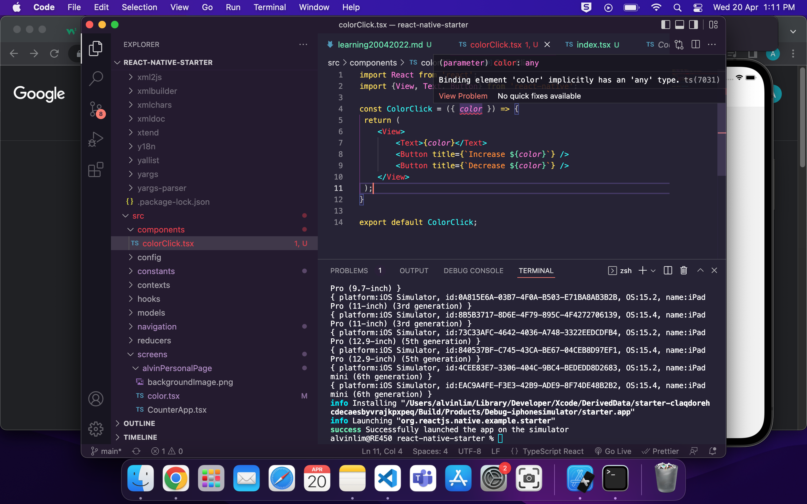
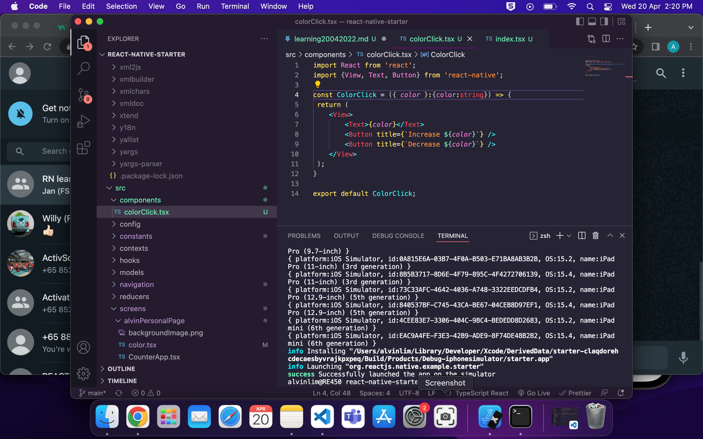
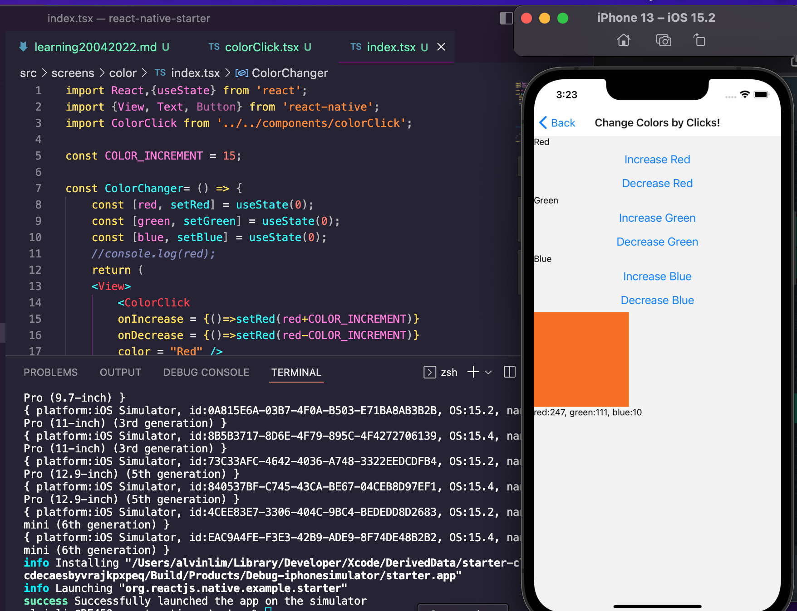
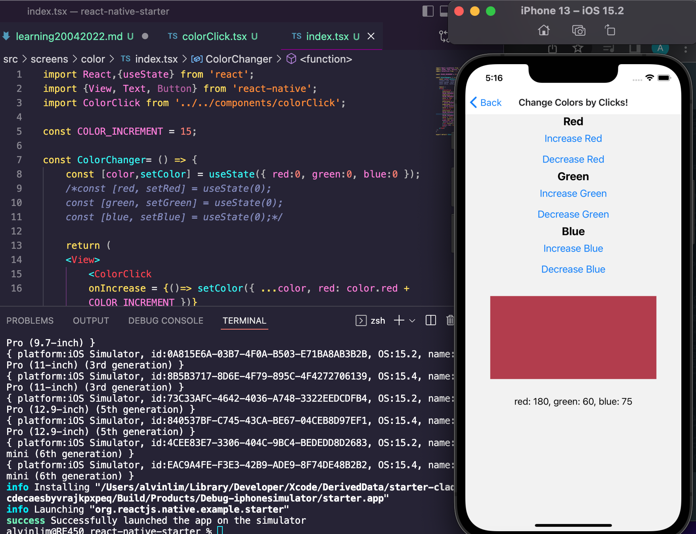

 

<h3 align="center">Learning Journal 20 & 21 April 2022</h3>

<!-- TABLE OF CONTENTS -->

  
Table of Contents

  <ul>
    <li><a href="#what-did-i-learn-today">What did I learn today?</a></li>
    <li><a href="#snippets">Snippets</a></li>
    <li><a href="#any-issues-i-encounter">Any issues I encounter?</a></li>
    <li><a href="#reflection">Reflection</a></li>
    <li><a href="#acknowledgments">Acknowledgments</a></li>
    <li><a href="#resource-links">Resource Links</a></li>
      </ul>
     

<!-- ABOUT THE PROJECT -->
## What did I learn today? ##
----
<!-- Type what you learnt here -->
### React Native ###
  - Generally the states variable will be placed in the parents elements that need to read or change a state value.
  - If a child (color counter) needs to read a state value, the parent can pass it down as a prop
  - Based on the video, I have understood that the Screen.tsx will be used for us to set the states variables and the props for our reusable components to use.
  - Our reusable components will then call in the states variable as a props and do a callback function for the function that was passed in the parent element (the screen.tsx).
  - useState hook does not automatically merge and update the object

### React Global Summit 2022 - Jr Track ###
  - This is the 1st summit I have ever attend, no joke!
  - I have tried my best to take down notes alongside with the presentation.
  - I felt that this is like a mass introduction of products/packages individuals/organisations have created.
  - **DLS (Design language sys)**
    - provides a single source of truth which allows for consistency.
    - And it uses Atomic design as a method to categorise UI basing on organic chemistry model.
    - Simpler components are contained in more complex components in a design system.
    - Designer use to understand overall design principles and overview all avail design assets.
    - Dev use to understand the component states.
    - Process of DLS: ID, Categorise, design and implement
    - **Resources**
      - StoryBook: https://storybook.js.org/docs/react/get-started/introduction https://github.com/binh710/sample-react-storybook-dls#readme
      - Mdx: https://mdxjs.com/
  - **Why store when there is state:** 
    - when u shutdown the app, the data will be gone.
    - Dexie: local storage for browser https://dexie.org/
  - **Art generation:**
    - you can create a system that autonomously create art.
  - **React Keys: not just for lists!**
    - Keys: A unique and stable id
    - React reconciliation:
      - when a re-render occur
      - when React updates during State/Prop change
      - key allows react to recognise the list items.
    - in order to make the response experience responsive after button press action, store the value into the client state.
    - When your key changes, React will re-render the page through the process of unmounting and remounting the component.
  - **PWA**
    - progressive web app - you can use a web app with functionalities without the need to install a native app.
    - Tools: Lighthouse
  - **Test** 
    - require external domain are flaky
    - In the case of no internet connection, the test would err.
    - Global Mocks
    - Jest.fn()
    - Fetch-mock

## Snippets ##
----
<!-- You can attach snippets of your end product here -->  
  - **[Before]Applying type to Props**

    
  
  - **[After]Applying type to Props**

    

  - **Label Below Color**

    

  - **After convert State to an object**

    

## Any issues I encounter? ##
----
<!-- Type Your Issues Faced today Here -->
  - Encountered props being any type and being highlighted. Since it is not advisable to use any type as it beats the purpose of TypeScript. Hence, I have to set types to the props. 
  Screenshot as shown in the second screenshot above. 
  **Thanks to Willy for the advice!**

  - Encountered the app not being able to run properly when i converted the state to an object. And went on to research more and resolved the issue. I learnt that since useState is not able to merge and update the states into the object, I have to use the spread operator inside the setState function.
  For instance: `onIncrease = {()=> setColor({ ...color, red: color.red + COLOR_INCREMENT })}`

## Reflection ##
<!-- Reflection here -->
Today I sincerely felt that one learning source will not be enough as that learning source may not be as clear and specific in the topic it is going through.

Henceforth, it would be great to research on more sources to clarify and find out more on the topic you have doubt on. You may also find other sources which may have clearer and more specific examples in these topic they are trying to cover.

I am thankful to the fact that Anya and Janan has breakdown the topics into smaller parts. It helped slower learners like me to have the time to rewatch the Udemy video and, to pause and code alongside with the video to understand the concept better. For concepts I have doubts, I went onto Youtube and StackOverflow to read what others have to advise.

Time Boxing is something i need to work on! I realised I get stuck in trying to fix a bug and lost track of my time..will prepare a timer so as to keep myself in check.

I still have not done the challenge 3. Will do so today.

<!-- ACKNOWLEDGMENTS -->
## Acknowledgments ##
----
* [Anya](https://github.com/huanganya/react-native-starter)
* Janan
* Othneil Drew for this ReadMe template

<!-- Resource Links -->
## Resource Links ##
----
* [Day 12: React Native State Management](https://docs.google.com/document/d/1BL3dsmubQsmnpAQhi0fTYJIMz8O4lv69ROukn39dsuc/edit#)

* [Understand React Native with Hooks, Context, and React Navigation.](https://nlbsg.udemy.com/course/the-complete-react-native-and-redux-course/learn/lecture/15706480#overview)

* [Defining Props in React Function Component with Typescript](https://www.pluralsight.com/guides/defining-props-in-react-function-component-with-typescript)

* [React Hooks Tutorial - 4 - useState with object](https://www.youtube.com/watch?v=-3lL8oyev9w)

* [React Global Summit 2022 - Junior Track](https://www.youtube.com/watch?v=u4QTr56t7iM)

(<a href="#top">back to top</a>)

