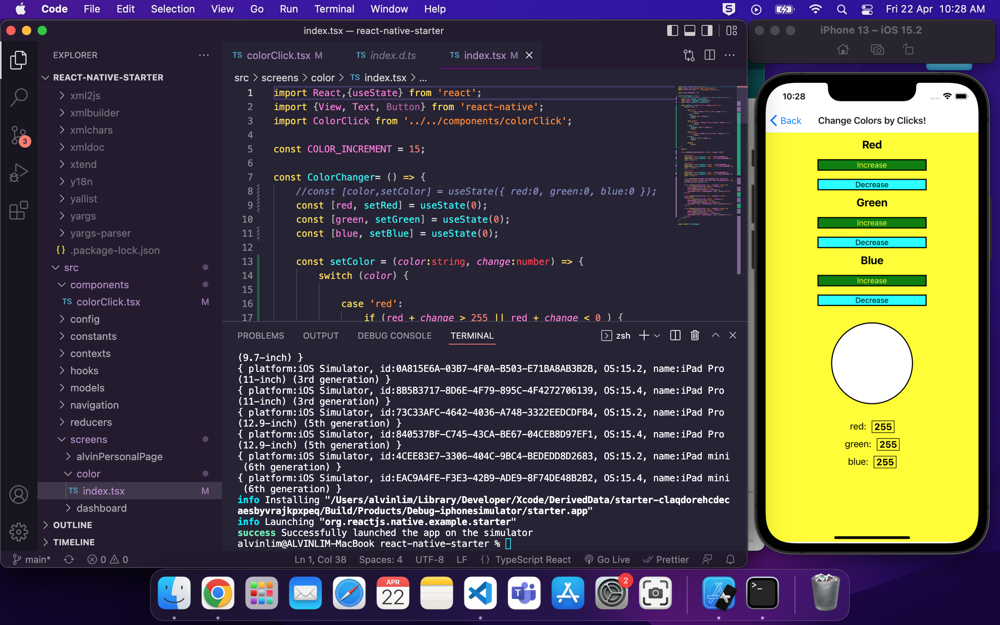
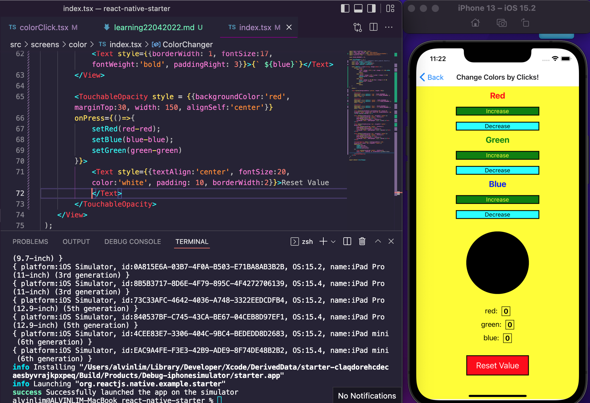
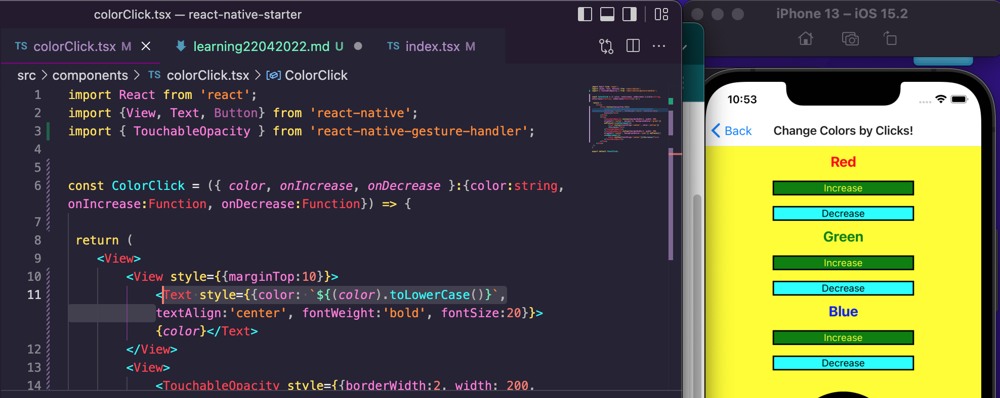

 

<h3 align="center">Learning Journal 22 April 2022</h3>

<!-- TABLE OF CONTENTS -->

  
Table of Contents

  <ul>
    <li><a href="#what-did-i-learn-today">What did I learn today?</a></li>
    <li><a href="#snippets">Snippets</a></li>
    <li><a href="#any-issues-i-encounter">Any issues I encounter?</a></li>
    <li><a href="#acknowledgments">Acknowledgments</a></li>
    <li><a href="#resource-links">Resource Links</a></li>
      </ul>
     

<!-- ABOUT THE PROJECT -->
## What did I learn today? ##
----
<!-- Type what you learnt here -->
### React Native ###
  - Deeper understanding of the Logical Operator
  `!(red + change > 255 || red + change < 0 ) && setColors ({...colors, red: red + change})`
  In the above code, we will split it into two operands, 
  First: `!(red + change > 255 || red + change < 0 )` is saying if red + change is below 255, it will return a `true` value, as red + change is **NOT** > 255. On the other hand, if red + change is above 255, then it will true `false` as red + change is indeed more than 255.
  
  Second: the `&&` acts as a short circuit evaluation. 
  Hence, immediately when the first expression comes to a falsy value, it will return the first expression value and stop running the second expression. 
  In the case when either the red + change is more than 255 or less than 255, it will return its final value (e.g. 255 or 0) and the second operand will not run. Thus, you won't be able to increase or decrease further when the value hits 255 or 0 respectively.

  Third: I have tried to set a button to reset the color config to initial value of Red: 0, Green: 0, Blue: 0.
  Thankful for Anya and Janan for the advices on how to improve the code.

## Snippets ##
----
<!-- You can attach snippets of your end product here -->  
  - **Applying validation checks into the color changer app**

    

  - **Added Reset Value Button**

    

## Any issues I encounter? ##
----
<!-- Type Your Issues Faced today Here -->
1. I tried to set the font colors based on the color value passed by the props. I spent some time researching on where I gone wrong. And it is fixed using the following code:
`${(color).toLowerCase()}`

2. I am trying to set the conditions for the touchable Opacity to be disabled when it reaches 0 or 255.

<!-- ACKNOWLEDGMENTS -->
## Acknowledgments ##
----
* [Anya](https://github.com/huanganya/react-native-starter)
* Janan
* Othneil Drew for this ReadMe template

<!-- Resource Links -->
## Resource Links ##
----
* [Day 13: React Native State Management](https://docs.google.com/document/d/1oK5syZNKl84an6b5rg3EHRSIEajXKJzBefa9rV4nxe0/edit)

* [Understand React Native with Hooks, Context, and React Navigation.](https://nlbsg.udemy.com/course/the-complete-react-native-and-redux-course/learn/lecture/15706480#overview)

* [React-Native UpperCase, LowerCase](https://swairaq.medium.com/react-native-letter-casing-uppercase-lowercase-8944cb98a2f0)

* [Logical AND (&&)](https://developer.mozilla.org/en-US/docs/Web/JavaScript/Reference/Operators/Logical_AND)

(<a href="#top">Back to top</a>)

