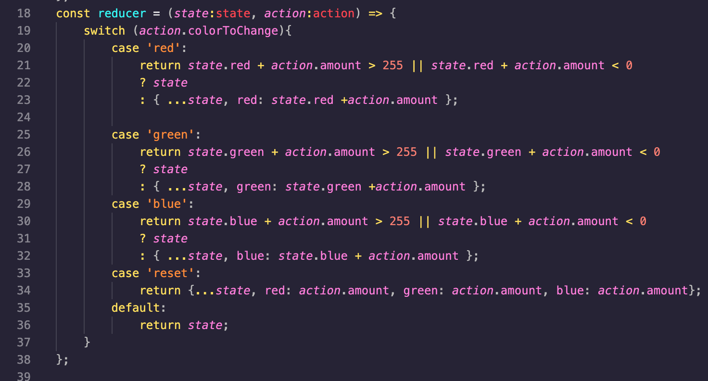
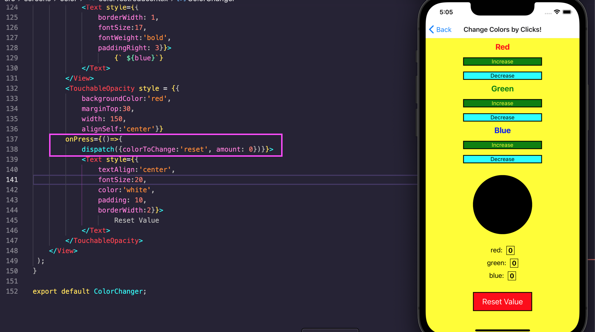

 

<h3 align="center">Learning Journal 25 April 2022</h3>

<!-- TABLE OF CONTENTS -->

  
Table of Contents

  <ul>
    <li><a href="#what-did-i-learn-today">What did I learn today?</a></li>
    <li><a href="#any-issues-i-encounter">Any issues I encounter?</a></li>
    <li><a href="#acknowledgments">Acknowledgments</a></li>
    <li><a href="#resource-links">Resource Links</a></li>
  </ul>
     

<!-- ABOUT THE PROJECT -->
## What did I learn today? ##
----
<!-- Type what you learnt here -->
### React Native ###

1. useReducer
  - Like useState, you can use useReducer to change the state value.
  - it takes in a reducer with state, action types and return current state with a dispatch method.
  - the dispatch method is like the setState method in useState as we are not to change the states directly, we have to use these methods to update our states value.
  - the dispatch method is can be known as runMyReducer method.
  - A reducer is a function of what you wish to do to your states.

## Any issues I encounter? ##
----
<!-- Type Your Issues Faced today Here -->
1. After using the useReducer, I am not able to make the reset button work.

2. I am still finding it difficult to understand useReducer.

**Update**
I have managed to resolve for the reset button through trial and error and this process allows me to understand the reducer more. 
What I did was to read the codes again, and I found that they use the dispatch to adjust states.
In other words, the dispatch function is similar to the setState function.
Then I have to go over to my switch cases and add in a case `reset` with the functionality of setting state back to 0 using the following codes `{...state, red: amount, green: amount, blue: amount}`

Now I have to go over to my `<TouchableOpacity>` codes to add an onPress action for the reset button by inserting colorToChange as reset and my amount as 0.

<!-- ACKNOWLEDGMENTS -->
## Acknowledgments ##
----
* [Anya](https://github.com/huanganya/react-native-starter)
* Janan
* Othneil Drew for this ReadMe template

<!-- Resource Links -->
## Resource Links ##
----
* [Day 13: React Native State Management](https://docs.google.com/document/d/1oK5syZNKl84an6b5rg3EHRSIEajXKJzBefa9rV4nxe0/edit)

* [Understand React Native with Hooks, Context, and React Navigation.](https://nlbsg.udemy.com/course/the-complete-react-native-and-redux-course/learn/lecture/15706480#overview)

(<a href="#top">Back to top</a>)

