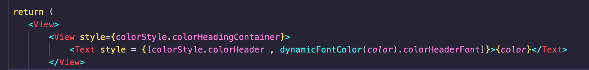
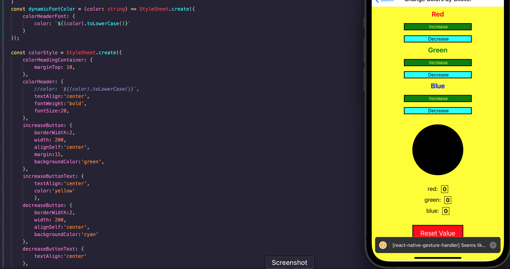

<div id="top"></div>

<br />

<h3 align="center">Learning Journal 26 April 2022</h3>

<!-- TABLE OF CONTENTS -->
<details>
  <summary>Table of Contents</summary>
  <ul>
    <li><a href="#what-did-i-learn-today">What did I learn today?</a></li>
    <li><a href="#any-issues-i-encounter">Any issues I encounter?</a></li>
    <li><a href="#acknowledgments">Acknowledgments</a></li>
    <li><a href="#resource-links">Resource Links</a></li>
  </ul>
     
</details>

<!-- ABOUT THE PROJECT -->
## What did I learn today? ##
----
<!-- Type what you learnt here -->
### React Native ###
- Using multiple styles for a component
- Creating a function stylesheet to accept props so as to allow it to change when props changes.


## Any issues I encounter? ##
----
<!-- Type Your Issues Faced today Here -->
**PROBLEM: Not able to access the props in the stylesheet.js**

I have an element (color title header) which will dynamically change the color according to the color props set in the parent. After I tried to clean up my code to separate the style, **I realise I am not able to access the props in the stylesheet.js**, hence the only option I could think of is to do in line color styling together with the alignment styling.

After exploring stackOverflow for solutions available I am trying to set the stylesheet.js an optional props so that for the font color i could access the color props from the parent in the component.

***In stylesheet***
```
const dynamicFontColor = (color: string) => StyleSheet.create({
    colorHeaderFont: {
        color: `${(color).toLowerCase()}`
 }
});
```
***In component page***

`<Text style = {[colorStyle.colorHeader , dynamicFontColor(color).colorHeaderFont]}>{color}</Text>`

I did not wrap the whole static stylesheet into the props changing stylesheet as I read that it might cause these static styles to re-render when the props changes. Since static styles are not necessary to respond to props changes, it is better to split the styles to those that needs to be changed based on props and static styles.

In React Native we could wrap multiple styles using the [] array methods.

However, this will not work if you are doing a React project. Hence, if you are trying to use multiple styles in React, you could use the spread operators like:
`<div style={{ ...style1, ...style2 }}>`




<!-- ACKNOWLEDGMENTS -->
## Acknowledgments ##
----
* [Anya](https://github.com/huanganya/react-native-starter)
* Janan
* Othneil Drew for this ReadMe template

<!-- Resource Links -->
## Resource Links ##
----
* [Day 14: React Native State Management](https://docs.google.com/document/d/1u2p6RYAXM0bIEpcq3QLcvNYzZqDFWO_BHsbyUvRAuXM/edit#heading=h.s6fqwt13dqgl)

* [Day 15: React Native State Management](https://docs.google.com/document/d/1oZ-Y1BUfvoJBbGLuQL6tRokAkdU84RGOYHG8hrvq1_M/edit)

* [Understand React Native with Hooks, Context, and React Navigation.](https://nlbsg.udemy.com/course/the-complete-react-native-and-redux-course/learn/lecture/15706480#overview)

* [Wrap stylesheet in a function where you can optionally pass props](https://stackoverflow.com/a/65169306)

* [How to combine multiple inline style objects?](https://stackoverflow.com/questions/29979324/how-to-combine-multiple-inline-style-objects)

<p align="right">(<a href="#top">Back to top</a>)</p>

