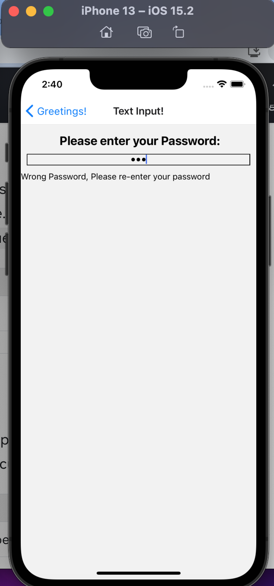
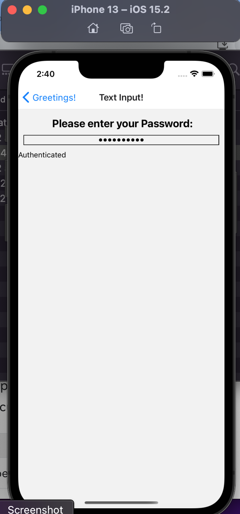

 

<h3 align="center">Learning Journal 27 April 2022</h3>

<!-- TABLE OF CONTENTS -->

  
Table of Contents

  <ul>
    <li><a href="#what-did-i-learn-today">What did I learn today?</a></li>
    <li><a href="#any-issues-i-encounter">Any issues I encounter?</a></li>
    <li><a href="#acknowledgments">Acknowledgments</a></li>
    <li><a href="#resource-links">Resource Links</a></li>
  </ul>

<!-- ABOUT THE PROJECT -->
## What did I learn today? ##
----
<!-- Type what you learnt here -->
### React Native ###

- More Recaps on useReducer, useReducer hook takes in the reducer function and the initial state as parameters, and return the final state and a dispatch method as an output.

- The layman term of `dispatch` is it dispatches your actions

- `payload` is optional for your `action.type`, it all depends on your `action.type`.

- `action.type` is like the different cases your reducer functions is designed to tackle.

- `<TextInput />` allows users to key in stuffs into a field.
  
  - By itself, there is 0 styling so it will not be visible to user if there are no styling done to the text input.
  
  - 2 Important Props you need to add in the `<TextInput />` tag:

    1. ios will have default autocaps and autocorrect: `autoCapitalize` which will gives you 4 selections. if you don't wish for autoCapitalize, choose `None`.

      - let's say if u are trying to implement a name field, it would be good to set `autoCapitalize` to `'words'` so that for every first letter of a string after a space, it would get auto capitalised.

    2. `autoCorrect` which accepts boolean as the input, i.e. if you do not want autoCorrect, key `{false}`
  
  - Screen to hold a piece of state with 2 props: 
    1. `value`: current state
    2. `onChangeText`: callback function will be invoked. So when the value is being changed the state is being updated. And to rerender the screen to show the updated value.
  - For password inputs, we can use the `secureTextEntry` props to mask out the password while users are keying.

  *Failed Password Check*:

  

  *Authenticated Password*:

  

## Any issues I encounter? ##
----
<!-- Type Your Issues Faced today Here -->
**First Issue**
Having difficulty of trying to implement useReducer into the exercise of the password input field.

I was confused when I tried `console.log (state===initialValue)` and it returns `false` although the values are all the same.

I read on and found out that in order to compare objects, I have to compare the object values by values. By doing the earlier code I am just comparing FruitBasket A vs FruitBasket B, it is different no matter how similar the values are.

**Second Issue**
I had difficulty implementing the disabled button into the color changing app as I have to come up with the condition and also think of how to make it into a props in the parent so that in the child component, I could pick up as prop and accordingly rendered the conditions.

Thankfully, I have managed to resolved the issue!

<!-- ACKNOWLEDGMENTS -->
## Acknowledgments ##
----
* [Anya](https://github.com/huanganya/react-native-starter)
* Janan
* Othneil Drew for this ReadMe template

<!-- Resource Links -->
## Resource Links ##
----
* [Day 16: React Native State Management](https://docs.google.com/document/d/1CgCVkYPjIPhzmCocm61pk1aq9m_HoGSM0jazJdqVxyM/edit)

* [Understand React Native with Hooks, Context, and React Navigation.](https://nlbsg.udemy.com/course/the-complete-react-native-and-redux-course/learn/lecture/15706480#overview)

* [React Native Docs](https://reactnative.dev/docs/textinput#securetextentry)

(<a href="#top">Back to top</a>)

