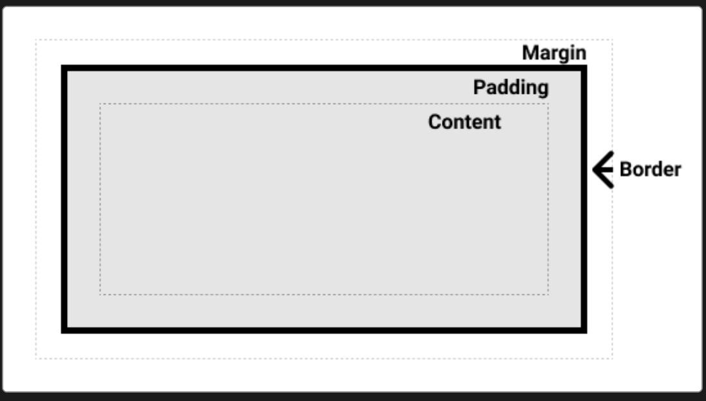

<div id="top"></div>

<br />

<h3 align="center">Learning Journal 28 April 2022</h3>

<!-- TABLE OF CONTENTS -->
<details>
  <summary>Table of Contents</summary>
  <ul>
    <li><a href="#what-did-i-learn-today">What did I learn today?</a></li>
    <li><a href="#any-issues-i-encounter">Any issues I encounter?</a></li>
    <li><a href="#acknowledgments">Acknowledgments</a></li>
    <li><a href="#resource-links">Resource Links</a></li>
  </ul>
</details>

<!-- ABOUT THE PROJECT -->
## What did I learn today? ##
----
<!-- Type what you learnt here -->
### React Native ###

- Importing lodash for quick and cleaner codes when comparing arrays, collections and objects.

- `===`, `==` are referential comparison, hence they are not comparing the values of the objects. They are used if you want to compare primitive data types. e.g. string, number

- CSS Layout elements:
  - Box Object Model
    - Padding
    - Margin
    - Border
    - Content

  

  - Flexbox
    - alignItems
    - flexDirection
    - justifyContent
    - flexValues
    - alignSelf

  - Positions
    - relative: default
    - absolute: ignore the sibling element and obey parent styling
    - top, bottom, left, right: it will shift the element based on the direction and the magnitude
    - absolutefill: the child element will ignore the sibling and cover the parent element `...StyleSheet.absoluteFillObject`

## Any issues I encounter? ##
----
<!-- Type Your Issues Faced today Here -->
**Challenge 1**
I am trying to add in password validation and usage of use reducer into the password exercise yesterday.
However, when I am doing a test by typing, it kept prompting me as password field is empty whenever i type an alphabet.

*In my reducer function I have a switch case cater for empty input*

```
case ActionToDo.Empty:
            if (isEmpty(password)) {
                Alert.alert('You have not key in your password! Minimum 8 characters.');
                return initialPassword
            } else {
                return password
            }
```

*and my onChangeText prop will launch a test on the input*

```
onChangeText = {()=> {if (isEmpty(password)) {
              dispatch({type: ActionToDo.Empty, payload: password.input})
        } else {
              dispatch({type: ActionToDo.Submit, payload: password.input})
        }
```

But what this code did was to re-render whenever I type something, and it always prompt `isEmpty(password)` as true, thus, it keeps launching the empty error message when I key 1 alphabet.

I will be recoding from the start which can help me to fully understand useReducer hook further!! *I'm not giving up*

<!-- ACKNOWLEDGMENTS -->
## Acknowledgments ##
----
* [Anya](https://github.com/huanganya/react-native-starter)
* Janan
* Othneil Drew for this ReadMe template

<!-- Resource Links -->
## Resource Links ##
----
* [Day 17: React Native State Management](https://docs.google.com/document/d/1oqOjm59OuK4851gzJ2tOMHdC5G2OcKV067PUKadJjho/edit)

* [Understand React Native with Hooks, Context, and React Navigation.](https://nlbsg.udemy.com/course/the-complete-react-native-and-redux-course/learn/lecture/15706480#overview)

* [useReducer](https://www.youtube.com/watch?v=o-nCM1857AQ)

* [React Native Docs](https://reactnative.dev/docs/textinput#securetextentry)

<p align="right">(<a href="#top">Back to top</a>)</p>

