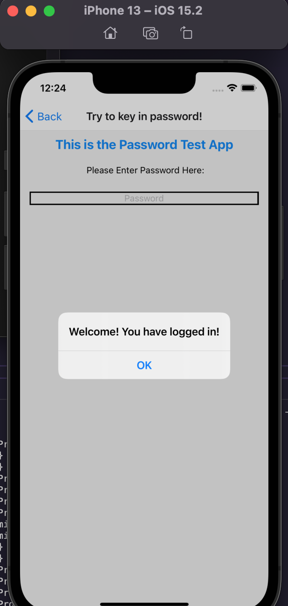

 

<h3 align="center">Learning Journal 29 April 2022</h3>

<!-- TABLE OF CONTENTS -->

  
Table of Contents

  <ul>
    <li><a href="#what-did-i-learn-today">What did I learn today?</a></li>
    <li><a href="#any-issues-i-encounter">Any issues I encounter?</a></li>
    <li><a href="#acknowledgments">Acknowledgments</a></li>
    <li><a href="#resource-links">Resource Links</a></li>
  </ul>

<!-- ABOUT THE PROJECT -->
## What did I learn today? ##
----
<!-- Type what you learnt here -->
### Timeline of Designing and Developing ###

- Designing typically 2 sprints ahead of the Developing.

### React Native ###

- Today I am trying to start a new RN project so as to build a project from scratch

  - I am following the Udemy videos to kickstart the building of the new React Native Project

  - I have encountered some error message after i install navigation library and trying to run ios

    - I resolve it by deleting Expo Go app on iOS simulator

    - then run `npm run ios` 

- Learning to do a splash screen in before transiting into the login page
  
  - Thinking of doing a component screen which will feature the image carousel using the `react-native-snap-carousel` package.
  
## Any issues I encounter? ##
----
<!-- Type Your Issues Faced today Here -->
**Challenge From Yesterday**
I am trying to add in password validation and usage of use reducer into the password exercise yesterday.
However, when I am doing a test by typing, it kept prompting me as password field is empty whenever i type an alphabet.

  - **UPDATE**

    I have fixed the issue by recoding the code and changing my switch statement. earlier, my switch statement will keep prompt a validation whenever i key in something. Henceforth, I need to set a switch case in the reducer function to accept the user's input.

  - **Lesson Learnt** 

    I have to think more systematically as I didn't think of how will the system accept input inbefore i implement the authentication steps.

    
<!-- ACKNOWLEDGMENTS -->
## Acknowledgments ##
----
* [Anya](https://github.com/huanganya/react-native-starter)
* Janan
* Othneil Drew for this ReadMe template

<!-- Resource Links -->
## Resource Links ##
----
* [Day 18: React Native State Management](https://docs.google.com/document/d/1TOF_50A_FjK3L7AnxT72bd5flXcRrjGWKo4cpPXYUDk/edit#)

* [Understand React Native with Hooks, Context, and React Navigation.](https://nlbsg.udemy.com/course/the-complete-react-native-and-redux-course/learn/lecture/15706480#overview)

* [expo error installing or running app](https://stackoverflow.com/questions/51147704/expo-error-installing-or-running-app)

* [React Native Docs](https://reactnative.dev/docs/textinput#securetextentry)

* [React Native carousel with react-native-snap-carousel](https://blog.logrocket.com/implement-react-native-snap-carousel/)

*[react-native-snap-carousel](https://github.com/meliorence/react-native-snap-carousel)

(<a href="#top">Back to top</a>)

