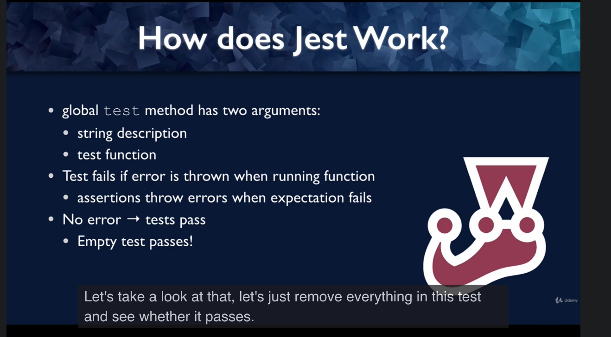
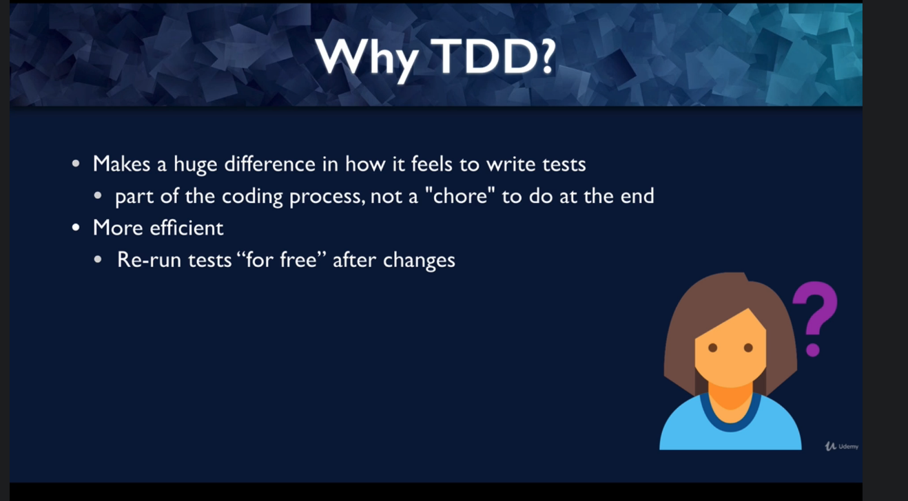

 

<h3 align="center">Learning Journal 01 June 2022</h3>

<!-- TABLE OF CONTENTS -->

  
Table of Contents

  <ul>
    <li><a href="#what-did-i-learn-today">What did I learn today?</a></li>
    <li><a href="#acknowledgments">Acknowledgments</a></li>
    <li><a href="#resource-links">Resource Links</a></li>
  </ul>

<!-- ABOUT THE PROJECT -->
## What did I learn today? ##
----
<!-- Type what you learnt here -->

### Learning about Unit Testing ###

- Test for Parent Component *Passed* but there's an console error; Attempting to fixed this issue and 2 others warnings: **Resolved**

  

  Fix: Wrapping my expect in `await waitFor(() => {//insert expect codes in here})` this is because in the App contains Axios hence we need to await for the result.

  [Resource](https://stackoverflow.com/a/71520359)

  

  Warnings Fix: [Add `jest.mock('react-native/Libraries/Animated/NativeAnimatedHelper')`](https://stackoverflow.com/a/59593847)

- React Testing Library vs Jest

  - React Testing Library renders components into virtual DOM for testing

  - Jest is a test runner that 

    - find, run test and determine whether test pass or fail

- render will create a virtual DOM and access the virtual DOM using `screen` global

- `screen.getByText()` = find element by text

- Put in the element you want to search into the parenthesis

- Jest Assertions: `expect(arg1).toBeInTheDocument(arg2)`

  - `expect` method: jest global, starts the assertion

  - `arg1` : expect argument; it is used as the subject of assertion

  - `toBeInTheDocument` is a matcher, it is the type of the assertion. It comes from the Jest-DOM

  - `arg2`: sometimes there will be this argument to refine the matcher

  - more example: `expect(element.textContent).toBe('hello')`

- Jest-DOM:

  - DOM based matchers can be found in here.

  - It is where u can import the matchers from.

- How Jest works:

  

- Test Driven Dev:

  - Write test before code: then write code to pass the test requirements

  - red-green testing:

    - tests failed before coding: before u code ur test should be fail; and subsequently when u start to code, ur test will pass
  
  - Why do TDD?

    

- Functional testing: to test the behaviour of your codes; it could contain multiple of units within a behaviour

  

<!-- ACKNOWLEDGMENTS -->
## Acknowledgments ##
----
* [Anya](https://github.com/huanganya/react-native-starter)
* Janan
* Othneil Drew for this ReadMe template

<!-- Resource Links -->
## Resource Links ##
----

* [React Testing Library](https://testing-library.com/docs/react-testing-library/intro/)

* [Guide to unit testing in React Native](https://blog.logrocket.com/unit-testing-react-native/#:~:text=Jest%20provides%20the%20testing%20environment,or%20a%20native%20mobile%20environment.)

* [callstack/react-native-testing-library](https://github.com/callstack/react-native-testing-library)

* [Testing React with Jest and React Testing Library (RTL)](https://nlbsg.udemy.com/course/react-testing-library/learn/lecture/24418712#overview)

* [Hooks API Reference](https://reactjs.org/docs/hooks-reference.html)

* [Custom Hooks](https://reactjs.org/docs/hooks-custom.html)

* [React Context for Beginners – The Complete Guide (2021)](https://www.freecodecamp.org/news/react-context-for-beginners/#:~:text=React%20context%20caveats-,What%20is%20React%20context%3F,across%20our%20components%20more%20easily.)

* [Navigation undefined - TypeError: undefined is not an object (evaluating 'navigation.navigate')](https://stackoverflow.com/questions/66293379/navigation-undefined-typeerror-undefined-is-not-an-object-evaluating-naviga)

* [How to convert ExpressJS to TS](https://blog.phillipninan.com/how-to-convert-expressjs-to-typescript)

(<a href="#top">Back to top</a>)

