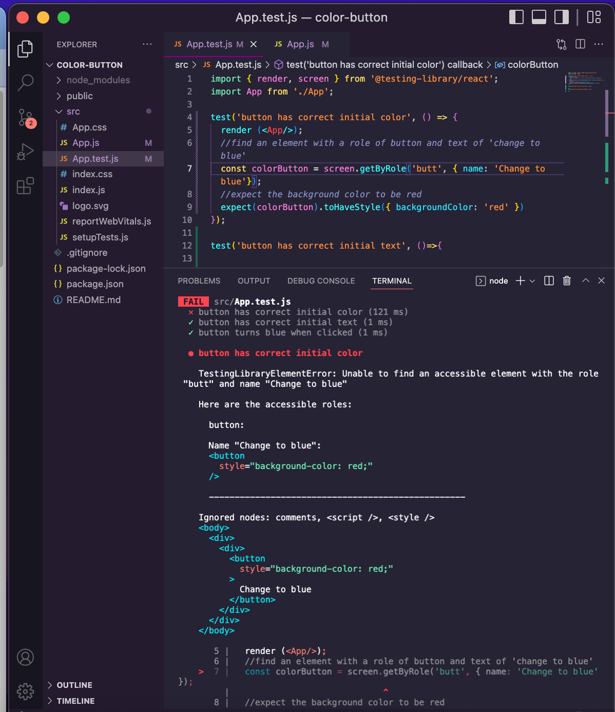
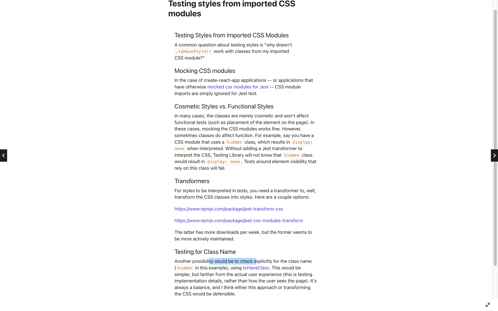
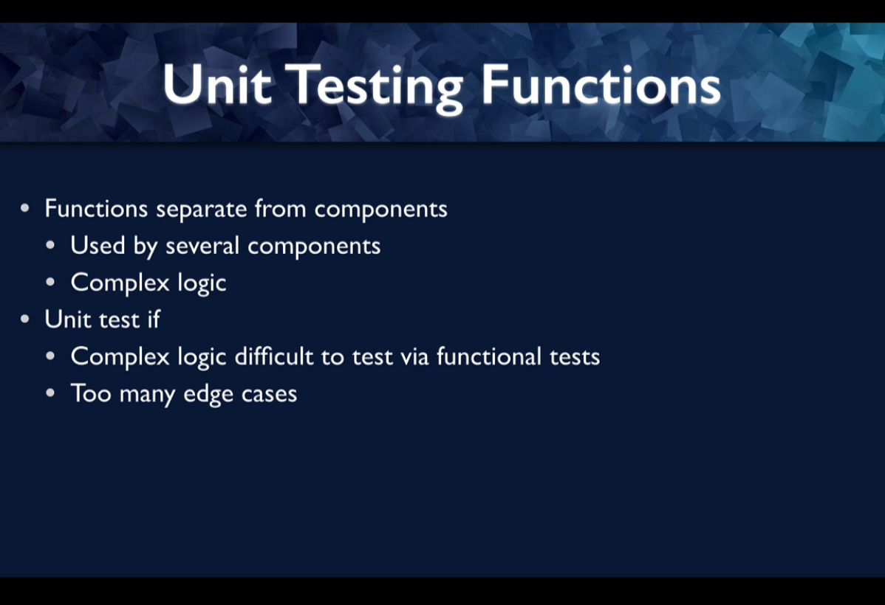
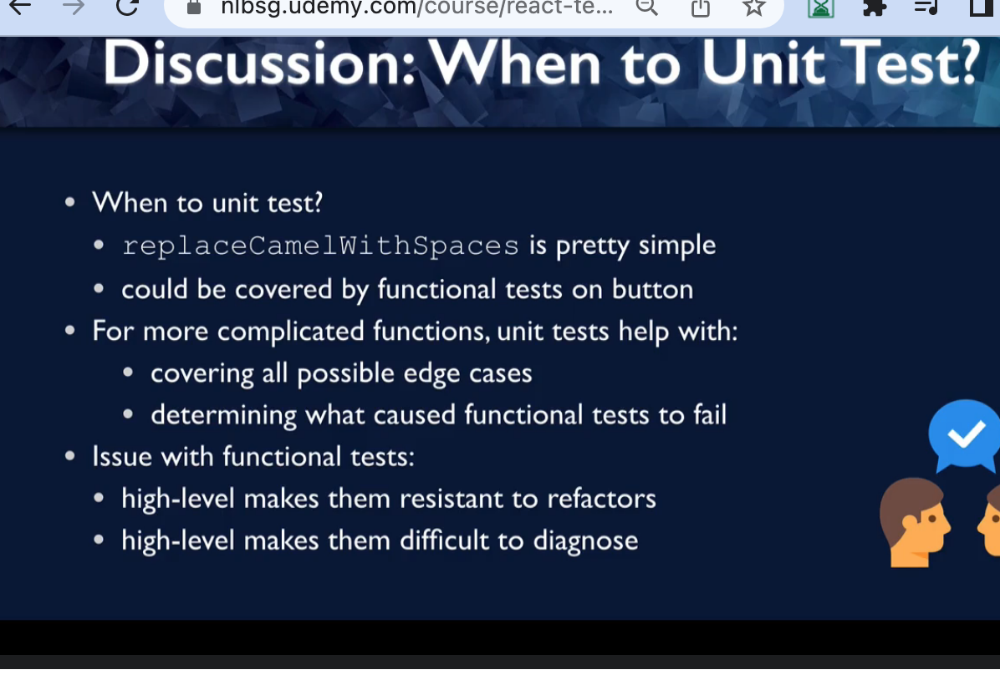

 

<h3 align="center">Learning Journal 02 June 2022</h3>

<!-- TABLE OF CONTENTS -->

  
Table of Contents

  <ul>
    <li><a href="#what-did-i-learn-today">What did I learn today?</a></li>
    <li><a href="#acknowledgments">Acknowledgments</a></li>
    <li><a href="#resource-links">Resource Links</a></li>
  </ul>

<!-- ABOUT THE PROJECT -->
## What did I learn today? ##
----
<!-- Type what you learnt here -->

### Learning about Unit Testing ###

- **If you are unsure of the role of the Element**

  - You can key in for instance `const colorButton = screen.getByRole('butt', { name: 'Change to blue'});`

  - React Testing Library will tell you there is no such element called `butt` but will suggest to you, however, there is another element that might fits your bill!

  

- `npm test` will run watcher which will lookout for changes in your source file so they will automatically rerun the test when they detect a change

- **Testing CSS Modules**

  

- Specifying which element we want in the second argument of the `getByRole` matcher; so as to refine our search in case of multiple similar elements in the component.

  - in `const colorButton = screen.getByRole('button', { name: 'Change to blue' });`, `{ name: 'Change to blue' }` is the refinement in our matcher.

- **Unit Testing Functions**

  

  - `describe` statement is used to group multiple tests into one group

  - When to Unit test:

  

<!-- ACKNOWLEDGMENTS -->
## Acknowledgments ##
----
* [Anya](https://github.com/huanganya/react-native-starter)
* Janan
* Othneil Drew for this ReadMe template

<!-- Resource Links -->
## Resource Links ##
----

* [React Testing Library](https://testing-library.com/docs/react-testing-library/intro/)

* [Guide to unit testing in React Native](https://blog.logrocket.com/unit-testing-react-native/#:~:text=Jest%20provides%20the%20testing%20environment,or%20a%20native%20mobile%20environment.)

* [callstack/react-native-testing-library](https://github.com/callstack/react-native-testing-library)

* [Testing React with Jest and React Testing Library (RTL)](https://nlbsg.udemy.com/course/react-testing-library/learn/lecture/24418712#overview)

* [Hooks API Reference](https://reactjs.org/docs/hooks-reference.html)

* [Custom Hooks](https://reactjs.org/docs/hooks-custom.html)

* [React Context for Beginners – The Complete Guide (2021)](https://www.freecodecamp.org/news/react-context-for-beginners/#:~:text=React%20context%20caveats-,What%20is%20React%20context%3F,across%20our%20components%20more%20easily.)

* [Navigation undefined - TypeError: undefined is not an object (evaluating 'navigation.navigate')](https://stackoverflow.com/questions/66293379/navigation-undefined-typeerror-undefined-is-not-an-object-evaluating-naviga)

* [How to convert ExpressJS to TS](https://blog.phillipninan.com/how-to-convert-expressjs-to-typescript)

(<a href="#top">Back to top</a>)

