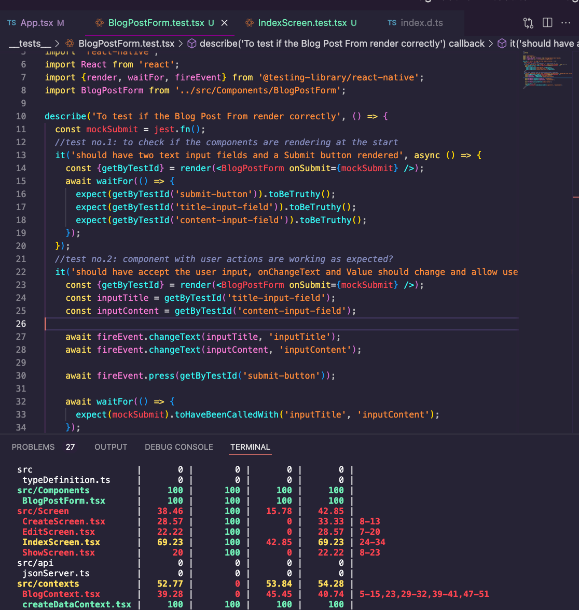
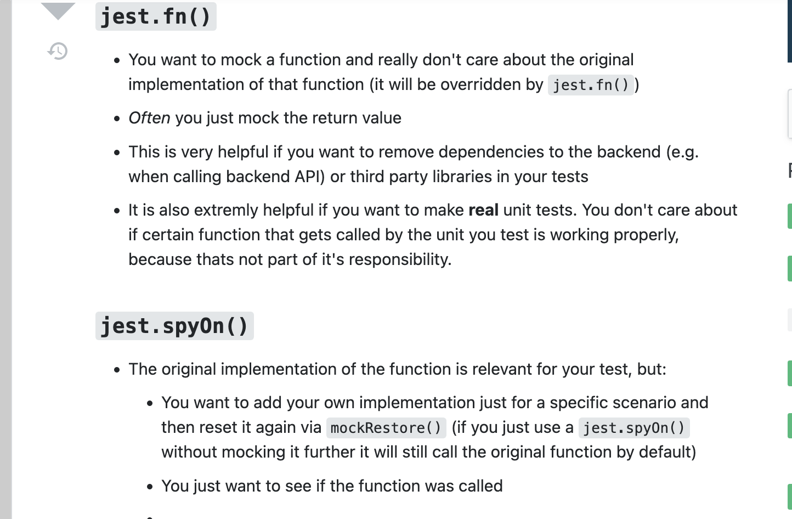

 

<h3 align="center">Learning Journal 03 && 06 June 2022</h3>

<!-- TABLE OF CONTENTS -->

  
Table of Contents

  <ul>
    <li><a href="#what-did-i-learn-today">What did I learn today?</a></li>
    <li><a href="#acknowledgments">Acknowledgments</a></li>
    <li><a href="#resource-links">Resource Links</a></li>
  </ul>

<!-- ABOUT THE PROJECT -->
## What did I learn today? ##
----
<!-- Type what you learnt here -->

- Writing a test script for the blogpost form component:

  - Upon covering the component, I realised, some of the other scripts have also some % being covered.

  

  - `fireEvent` will simulate an user action such as `press, changeText, scroll`. This API will simulate if the element will give the expected result by simulating the user's action

  - `it` and `test` is an alias of each other; they have similar function. However the main difference in using it is the readability:

    - `test(if it works, () => {});` & `it(should work, () => {});` [Reference](https://stackoverflow.com/questions/45778192/what-is-the-difference-between-it-and-test-in-jest)
  
- I feel that the implementation of `getByTestId` makes it seems like we are editing the code to accomodate our testing; In this case, I feel the test first code later manner is more efficient as you could plan what your elements should contain and its expected outcome.

- For test cases, I can actually use the user stories to come up with the cases.

- `spyOn` vs `jest.fn()`:

  
  
  [Reference](https://stackoverflow.com/a/57645643)

- Difficulty faced: (To continue to research)

  - Things to test in a FlatList:

    - <mark>Key Extractor: How can I test?</mark>

    - **Shall try to test on the rendering of the items first**

<!-- ACKNOWLEDGMENTS -->
## Acknowledgments ##
----
* [Anya](https://github.com/huanganya/react-native-starter)
* Janan
* Othneil Drew for this ReadMe template

<!-- Resource Links -->
## Resource Links ##
----

* [React Testing Library](https://testing-library.com/docs/react-testing-library/intro/)

* [Guide to unit testing in React Native](https://blog.logrocket.com/unit-testing-react-native/#:~:text=Jest%20provides%20the%20testing%20environment,or%20a%20native%20mobile%20environment.)

* [callstack/react-native-testing-library](https://github.com/callstack/react-native-testing-library)

* [Testing React with Jest and React Testing Library (RTL)](https://nlbsg.udemy.com/course/react-testing-library/learn/lecture/24418712#overview)

* [Hooks API Reference](https://reactjs.org/docs/hooks-reference.html)

* [Custom Hooks](https://reactjs.org/docs/hooks-custom.html)

* [React Context for Beginners – The Complete Guide (2021)](https://www.freecodecamp.org/news/react-context-for-beginners/#:~:text=React%20context%20caveats-,What%20is%20React%20context%3F,across%20our%20components%20more%20easily.)

* [Navigation undefined - TypeError: undefined is not an object (evaluating 'navigation.navigate')](https://stackoverflow.com/questions/66293379/navigation-undefined-typeerror-undefined-is-not-an-object-evaluating-naviga)

* [How to convert ExpressJS to TS](https://blog.phillipninan.com/how-to-convert-expressjs-to-typescript)

(<a href="#top">Back to top</a>)

