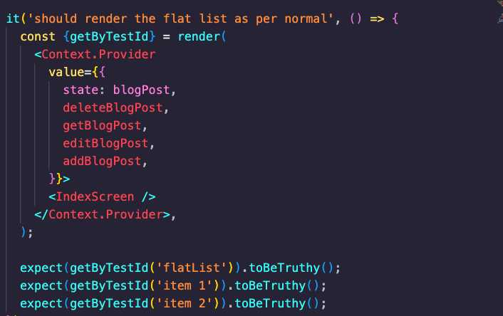
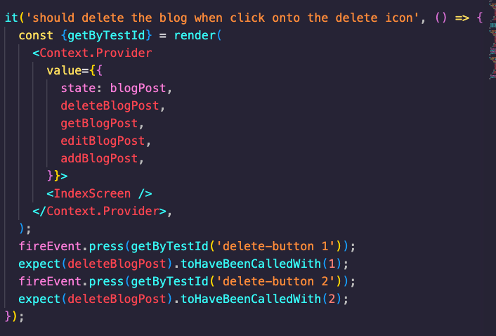
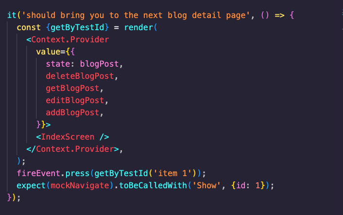
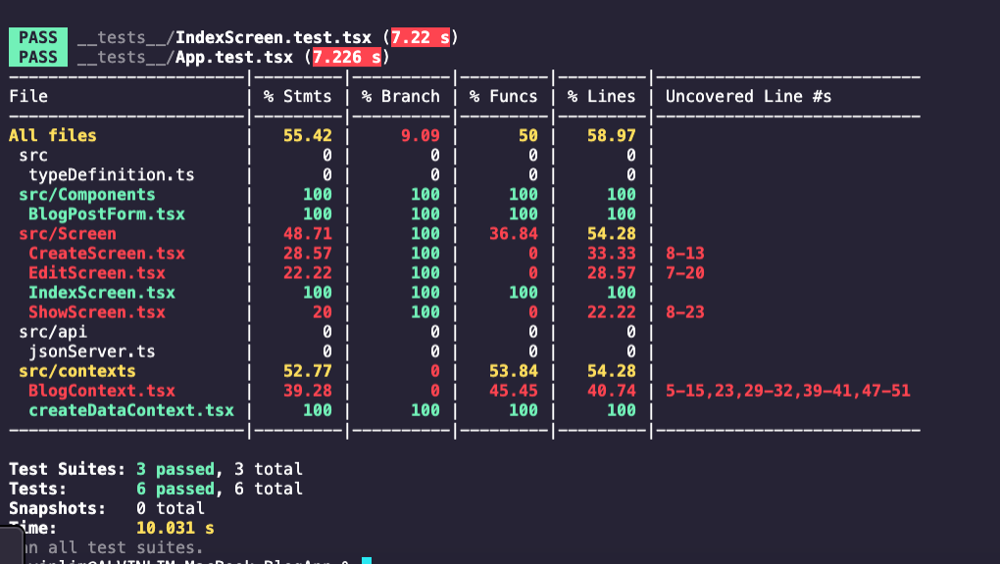

 

<h3 align="center">Learning Journal 07 June 2022</h3>

<!-- TABLE OF CONTENTS -->

  
Table of Contents

  <ul>
    <li><a href="#what-did-i-learn-today">What did I learn today?</a></li>
    <li><a href="#acknowledgments">Acknowledgments</a></li>
    <li><a href="#resource-links">Resource Links</a></li>
  </ul>

<!-- ABOUT THE PROJECT -->
## What did I learn today? ##
----
<!-- Type what you learnt here -->

- Test coverage: ACE

  - Acceptance testing based on user's stories/criteria

  - Code Coverage testing

  - Edge Cases

- FlatList Testing:

  **1. Test 1:**

    To test if the flatlist element is rendered when the page is first rendered.

    I also gave a mock data so as to simulate some data to be rendered

    

  **2. Test 2:**

    To test if the delete button works ideally by calling the method `deleteBlogPost` upon click.

    `expect(deleteBlogPost).toHaveBeenCalledWith(1)` : 
      
      `expect(deleteBlogPost)` = expect the method deleteBlogPost to have been called 
      
      `.toHaveBeenCalledWith(1)` = the method should have been called upon to delete the item id 1

    

  **3. Test 3:**

    To test if you click on the individual blog on the rendered flatlist, will it redirect you to that particular blog show screen

    `expect(mockNavigate).toBeCalledWith('Show', {id: 1});`

      `expect(mockNavigate)` : I expect the mockNavigate function to be called upon I press onto the blog so as to access the navigation props

      `.toBeCalledWith('Show', {id: 1});` : Upon clicking it, it should navigate me to `Show` screen, of the blog `id: 1`

    

- To continue my testing on other screens:

  

- Have to familiarise with the various matchers for `expect` 

  [Reference](https://jestjs.io/docs/expect)

<!-- ACKNOWLEDGMENTS -->
## Acknowledgments ##
----
* [Anya](https://github.com/huanganya/react-native-starter)
* Janan
* Othneil Drew for this ReadMe template

<!-- Resource Links -->
## Resource Links ##
----

* [React Testing Library](https://testing-library.com/docs/react-testing-library/intro/)

* [Guide to unit testing in React Native](https://blog.logrocket.com/unit-testing-react-native/#:~:text=Jest%20provides%20the%20testing%20environment,or%20a%20native%20mobile%20environment.)

* [callstack/react-native-testing-library](https://github.com/callstack/react-native-testing-library)

* [Testing React with Jest and React Testing Library (RTL)](https://nlbsg.udemy.com/course/react-testing-library/learn/lecture/24418712#overview)

* [Hooks API Reference](https://reactjs.org/docs/hooks-reference.html)

* [Custom Hooks](https://reactjs.org/docs/hooks-custom.html)

* [React Context for Beginners – The Complete Guide (2021)](https://www.freecodecamp.org/news/react-context-for-beginners/#:~:text=React%20context%20caveats-,What%20is%20React%20context%3F,across%20our%20components%20more%20easily.)

* [Navigation undefined - TypeError: undefined is not an object (evaluating 'navigation.navigate')](https://stackoverflow.com/questions/66293379/navigation-undefined-typeerror-undefined-is-not-an-object-evaluating-naviga)

* [How to convert ExpressJS to TS](https://blog.phillipninan.com/how-to-convert-expressjs-to-typescript)

(<a href="#top">Back to top</a>)

