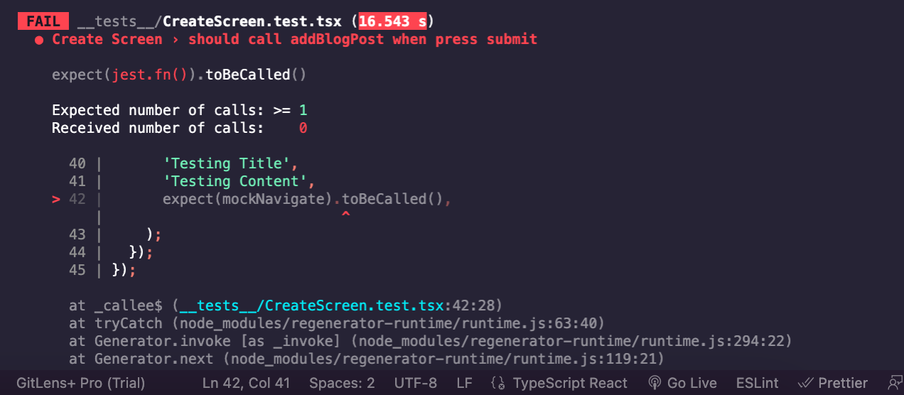

 

<h3 align="center">Learning Journal 09-10 June 2022</h3>

<!-- TABLE OF CONTENTS -->

  
Table of Contents

  <ul>
    <li><a href="#what-did-i-learn-today">What I did today?</a></li>
    <li><a href="#acknowledgments">Acknowledgments</a></li>
    <li><a href="#resource-links">Resource Links</a></li>
  </ul>

<!-- ABOUT THE PROJECT -->
## What I did today? ##
----
<!-- Type what you learnt here -->

<b>Trying out Unit Testing [Continued]</b>

  - While trying to simulate a onsubmit function:

    - I encountered an error not being able to call the navigation function despite mocking navigate

    - 

    - It cleared only through `expect.any(Function)`

    - when I use `expect(mockNavigate).toBeCalled();` or `expect(mockNavigate).toBeCalledWith('Index');` there will be an error message:

    - 

    - 

<!-- ACKNOWLEDGMENTS -->
## Acknowledgments ##
----
* [Anya](https://github.com/huanganya/react-native-starter)
* Janan
* Othneil Drew for this ReadMe template

<!-- Resource Links -->
## Resource Links ##
----

* [React Testing Library](https://testing-library.com/docs/react-testing-library/intro/)

* [Guide to unit testing in React Native](https://blog.logrocket.com/unit-testing-react-native/#:~:text=Jest%20provides%20the%20testing%20environment,or%20a%20native%20mobile%20environment.)

* [callstack/react-native-testing-library](https://github.com/callstack/react-native-testing-library)

* [Testing React with Jest and React Testing Library (RTL)](https://nlbsg.udemy.com/course/react-testing-library/learn/lecture/24418712#overview)

* [Hooks API Reference](https://reactjs.org/docs/hooks-reference.html)

* [Custom Hooks](https://reactjs.org/docs/hooks-custom.html)

* [React Context for Beginners – The Complete Guide (2021)](https://www.freecodecamp.org/news/react-context-for-beginners/#:~:text=React%20context%20caveats-,What%20is%20React%20context%3F,across%20our%20components%20more%20easily.)

* [Navigation undefined - TypeError: undefined is not an object (evaluating 'navigation.navigate')](https://stackoverflow.com/questions/66293379/navigation-undefined-typeerror-undefined-is-not-an-object-evaluating-naviga)

* [How to convert ExpressJS to TS](https://blog.phillipninan.com/how-to-convert-expressjs-to-typescript)

(<a href="#top">Back to top</a>)

