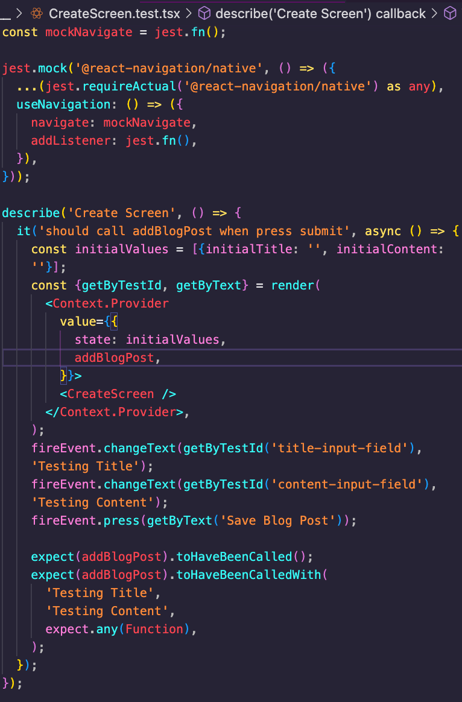
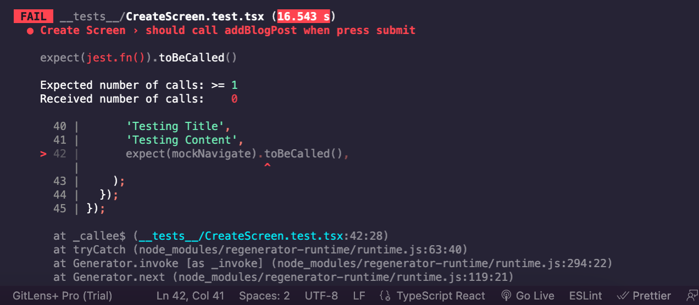
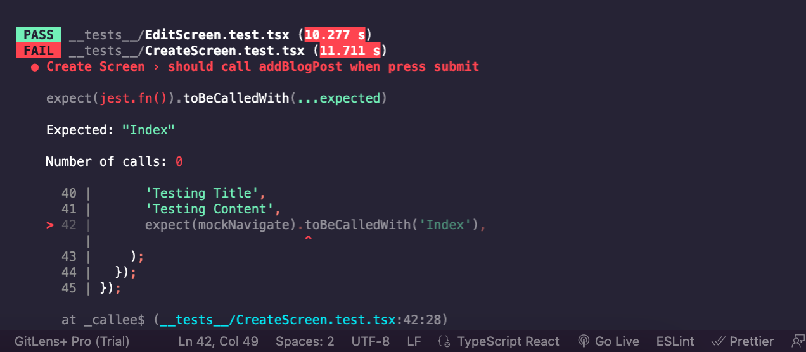
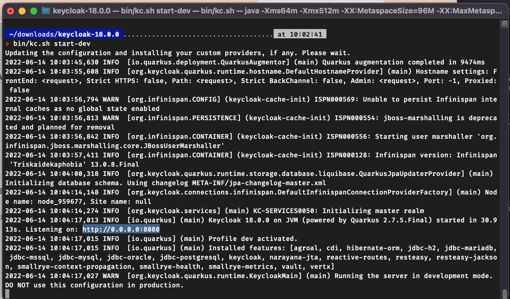
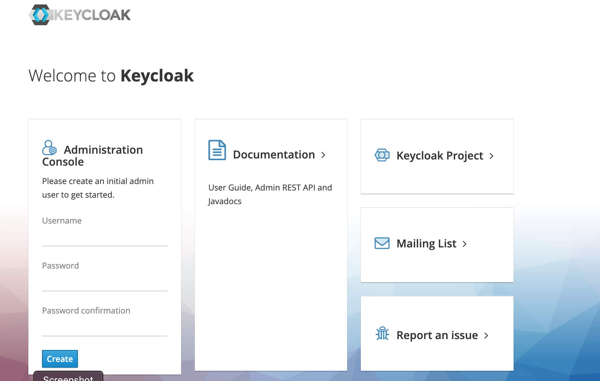
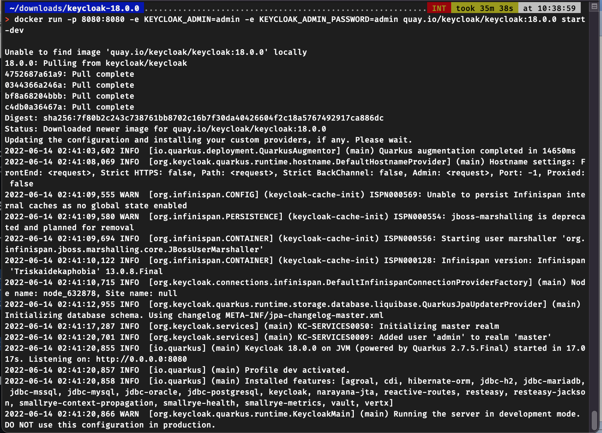

 

<h3 align="center">Learning Journal 13-14 June 2022</h3>

<!-- TABLE OF CONTENTS -->

  
Table of Contents

  <ul>
    <li><a href="#what-did-i-learn-today">What I did today?</a></li>
    <li><a href="#acknowledgments">Acknowledgments</a></li>
    <li><a href="#resource-links">Resource Links</a></li>
  </ul>

<!-- ABOUT THE PROJECT -->
## What I did today? ##
----
<!-- Type what you learnt here -->

<b>Trying out Unit Testing [Continued]</b>

  - While trying to simulate a onsubmit function:

    - I encountered an error not being able to call the navigation function despite mocking navigate

    - 

    - It cleared only through `expect.any(Function)`

    - when I use `expect(mockNavigate).toBeCalled();` or `expect(mockNavigate).toBeCalledWith('Index');` there will be an error message:

    - 

    - 

    - Thanks to Janan and Anya suggestion, I will continue to try to mock the jsonServer.post and see if the navigation callback function is being called correctly.

<b>Installing + Configuring KeyCloak for Development mode</b>

  1. Step 1: Download Keycloak ZIP [here](https://www.keycloak.org/downloads)

  2. Step 2: After download is completed, locate the downloaded zip in terminal

  3. Step 3: Unzip the zip file by running `unzip downloaded.zip`

  4. Step 4: To run the keycloak server in development mode: run `bin/kc.sh start-dev` in root folder dir and the terminal will show an address which the keycloak server is started in
  

  5. Step 5: Open the address in a browser and it will display the admin console
  

<b>Installing + Configuring KeyCloak</b>

  1. With Docker installed, at the terminal run, it will create admin username and password of `admin` :  
  `docker run -p 8080:8080 -e KEYCLOAK_ADMIN=admin -e KEYCLOAK_ADMIN_PASSWORD=admin quay.io/keycloak/keycloak:18.0.0 start-dev`

      [Reference](https://www.keycloak.org/getting-started/getting-started-docker)
    
      
  
  2. Open the address: http://0.0.0.0:8080

  3. Login at Admin Console using the above username and password

  4. `master` realm is for managing keycloak as a whole, do not use it to manage applications

  5. Hover the mouse over the dropdown in the top-left corner where it says Master, then click on Add realm

  6. Create a user for ur new realm and password. 

  7. at the address bar: replace `master` with `myRealm` or `yourNewRealmName` and enter into the account console.

  8. It is where user manager their account.

<b>Testing on share_frontend</b>

  1. to use `expect(getAllByText())` for `toHaveLength()`

<!-- ACKNOWLEDGMENTS -->
## Acknowledgments ##
----
* [Anya](https://github.com/huanganya/react-native-starter)
* Janan
* Othneil Drew for this ReadMe template

<!-- Resource Links -->
## Resource Links ##
----

* [React Testing Library](https://testing-library.com/docs/react-testing-library/intro/)

* [Guide to unit testing in React Native](https://blog.logrocket.com/unit-testing-react-native/#:~:text=Jest%20provides%20the%20testing%20environment,or%20a%20native%20mobile%20environment.)

* [callstack/react-native-testing-library](https://github.com/callstack/react-native-testing-library)

* [Testing React with Jest and React Testing Library (RTL)](https://nlbsg.udemy.com/course/react-testing-library/learn/lecture/24418712#overview)

* [Hooks API Reference](https://reactjs.org/docs/hooks-reference.html)

* [Custom Hooks](https://reactjs.org/docs/hooks-custom.html)

* [React Context for Beginners – The Complete Guide (2021)](https://www.freecodecamp.org/news/react-context-for-beginners/#:~:text=React%20context%20caveats-,What%20is%20React%20context%3F,across%20our%20components%20more%20easily.)

* [Navigation undefined - TypeError: undefined is not an object (evaluating 'navigation.navigate')](https://stackoverflow.com/questions/66293379/navigation-undefined-typeerror-undefined-is-not-an-object-evaluating-naviga)

* [How to convert ExpressJS to TS](https://blog.phillipninan.com/how-to-convert-expressjs-to-typescript)

(<a href="#top">Back to top</a>)

