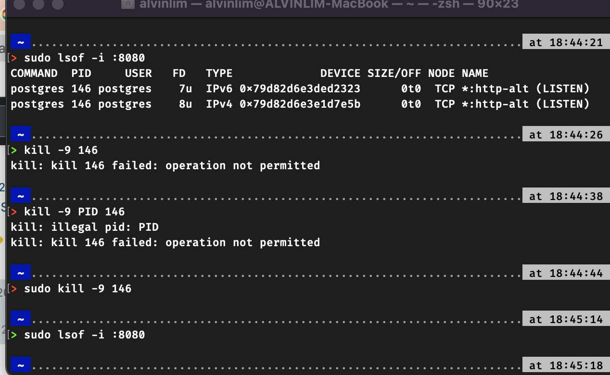

<div id="top"></div>

<br />

<h3 align="center">Learning Journal 17-18 June 2022</h3>

<!-- TABLE OF CONTENTS -->
<details>
  <summary>Table of Contents</summary>
  <ul>
    <li><a href="#what-did-i-learn-today">What I did today?</a></li>
    <li><a href="#acknowledgments">Acknowledgments</a></li>
    <li><a href="#resource-links">Resource Links</a></li>
  </ul>
</details>

<!-- ABOUT THE PROJECT -->
## What I did today? ##
----
<!-- Type what you learnt here -->

<b>Learning more about Dockers</b>

  - <b> Main Process </b>
    
    - Create an Empty Folder
    - Open in VSCode: navigate to project dir & `code .`
    - Create a file named - `Dockerfile`
    - `Dockerfile` is used to build an image
      
      ```FROM <<Insert base image>> 
      COPY /dir/to/where/you/want/to/store/data               
      WORKDIR /dir/where/you/are/at/now                       
      CMD <<command to run once the you are running the image>> e.g. CMD node app.js```
    
    - To build an image, run `docker build -t <<insert_name>>`
    - To run an image, `docker run <<insert_name>>`
  
  - <b>Docker Compose</b>

    - It is meant for multi-container app
    - `docker-compose.yaml` or `....yml` are acceptable, prefereably `yaml` format.
    - this file will state the dependency needed to be installed for the app
    - If array use hypen `-`, object use `indentations`
    - `docker-compose` file:
      - At root directory of project, create the `docker-compose.yaml` file.
      - `version: "3.8"` 
      - `services`: state what services will be in the app. It could have the front-end, back-end and database services.
        - name can be anything that you state, remember to keep it understandable to other devs
        - `build` => where can I find the dockerfile for this service
        -`image` => name of the image which you pull from (can be found on Docker Hub)
        -`volumes` => `-name of app:/title/name_of_service` (to map data to save into this stated dir)
    - `docker-compose build`: to build images based on the docker-compose.yaml file, Docker will build based on cache if there is any. If you want to rebuild add `--no cache`
    - `docker-compose up` to <b>start</b> and `docker-compose down` to <b>stop</b>

  - <b>If encountered port is used</b>

    -  try to list the processes that is occupying the port
        - `sudo lsof -i :<<insert ports here>>`
    -  kill the processes by stating the PID
        - `sudo kill -9 <<insert PID here>>`
    


## Acknowledgments ##
----
* [Anya](https://github.com/huanganya/react-native-starter)
* Janan
* Othneil Drew for this ReadMe template

<!-- Resource Links -->
## Resource Links ##
----

* [React Testing Library](https://testing-library.com/docs/react-testing-library/intro/)

* [Guide to unit testing in React Native](https://blog.logrocket.com/unit-testing-react-native/#:~:text=Jest%20provides%20the%20testing%20environment,or%20a%20native%20mobile%20environment.)

* [callstack/react-native-testing-library](https://github.com/callstack/react-native-testing-library)

* [Testing React with Jest and React Testing Library (RTL)](https://nlbsg.udemy.com/course/react-testing-library/learn/lecture/24418712#overview)

* [Hooks API Reference](https://reactjs.org/docs/hooks-reference.html)

* [Custom Hooks](https://reactjs.org/docs/hooks-custom.html)

* [Docker Tutorial](https://www.youtube.com/watch?v=pTFZFxd4hOI)

* [Navigation undefined - TypeError: undefined is not an object (evaluating 'navigation.navigate')](https://stackoverflow.com/questions/66293379/navigation-undefined-typeerror-undefined-is-not-an-object-evaluating-naviga)

* [How to convert ExpressJS to TS](https://blog.phillipninan.com/how-to-convert-expressjs-to-typescript)

<p align="right">(<a href="#top">Back to top</a>)</p>

