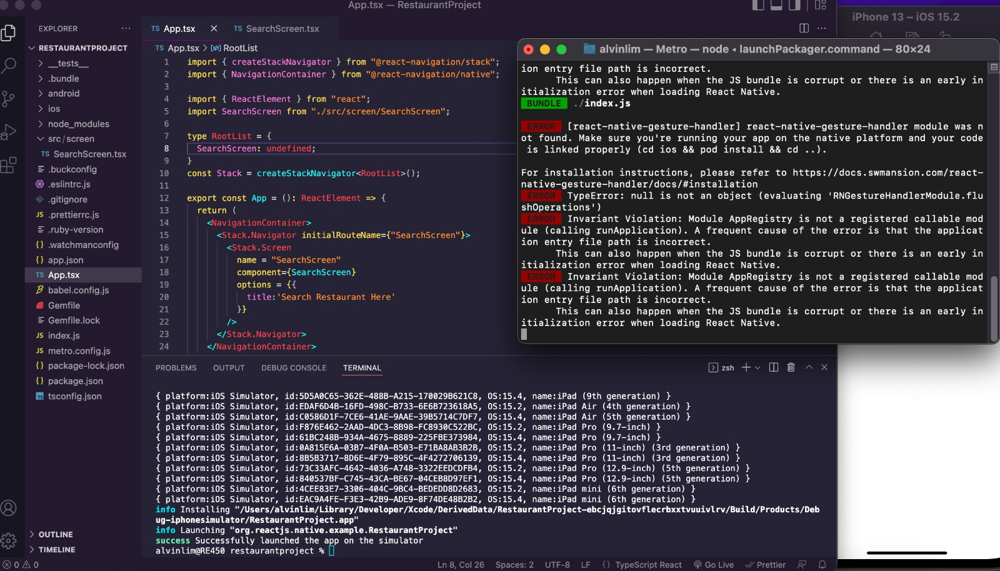
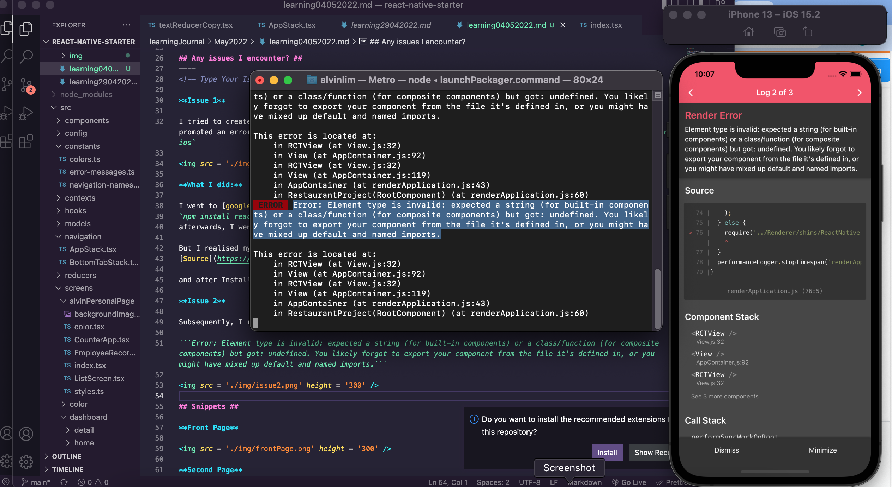

<div id="top"></div>

<br />

<h3 align="center">Learning Journal 04 May 2022</h3>

<!-- TABLE OF CONTENTS -->
<details>
  <summary>Table of Contents</summary>
  <ul>
    <li><a href="#what-did-i-learn-today">What did I learn today?</a></li>
    <li><a href="#any-issues-i-encounter">Any issues I encounter?</a></li>
    <li><a href="#snippets">Snippets</a></li>
    <li><a href="#acknowledgments">Acknowledgments</a></li>
    <li><a href="#resource-links">Resource Links</a></li>
  </ul>
</details>

<!-- ABOUT THE PROJECT -->
## What did I learn today? ##
----
<!-- Type what you learnt here -->

### React Native Navigation###
  
## Any issues I encounter? ##
----
<!-- Type Your Issues Faced today Here -->

**Issue 1**

I tried to create a new bare React Native project for the Restaurant App, Upon adding the Navigations codes, it prompted an error: `[react-native-gesture-handler] react-native-gesture-handler module was not found.` after `npm run ios`



**What I did:**

I went to [googled](https://stackoverflow.com/a/58562884), and installed react-native-gesture-handler.
`npm install react-native-gesture-handler --save`
afterwards, I went on to link `react-native link react-native-gesture-handler`.

But I realised my terminal do not have react native cli so i went to check on how to install.
[Source](https://stackoverflow.com/a/37193032)

and after Installing I went to `cd ios && pod install && cd ..` 

**Issue 2**

Subsequently, I run ios again and got a new error. Which Im not able to resolved, I have checked that the imports are all correct

```Error: Element type is invalid: expected a string (for built-in components) or a class/function (for composite components) but got: undefined. You likely forgot to export your component from the file it's defined in, or you might have mixed up default and named imports.```



## Snippets ##

**Search Page**


<!-- ACKNOWLEDGMENTS -->
## Acknowledgments ##
----
* [Anya](https://github.com/huanganya/react-native-starter)
* Janan
* Othneil Drew for this ReadMe template

<!-- Resource Links -->
## Resource Links ##
----
* [Day 19: React Native State Management](https://docs.google.com/document/d/1ORNCdknTltMnjBT9kYS7be3WTNDc6PXMe0r93LIa5JE/edit)

* [Understand React Native with Hooks, Context, and React Navigation.](https://nlbsg.udemy.com/course/the-complete-react-native-and-redux-course/learn/lecture/15706480#overview)

* [react-native-snap-carousel](https://github.com/meliorence/react-native-snap-carousel)

* [How to set a gradient background in React Native](https://www.kindacode.com/article/how-to-set-a-gradient-background-in-react-native/)

* [expo/vector-icons](https://github.com/expo/vector-icons)

* [Getting Started with React Navigation v5 - Stack, Tabs, Drawer, Authentication](https://www.youtube.com/watch?v=nQVCkqvU1uE)

<p align="right">(<a href="#top">Back to top</a>)</p>

