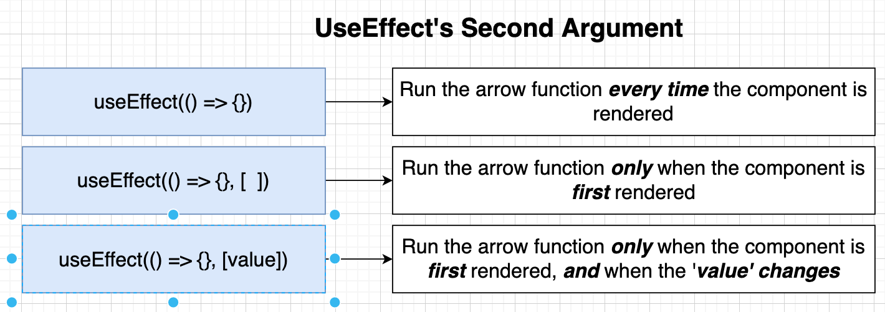
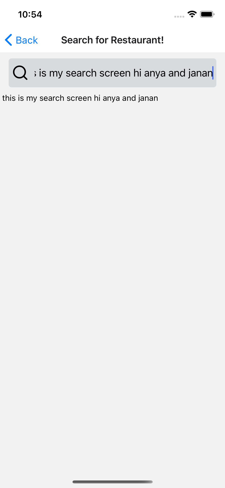
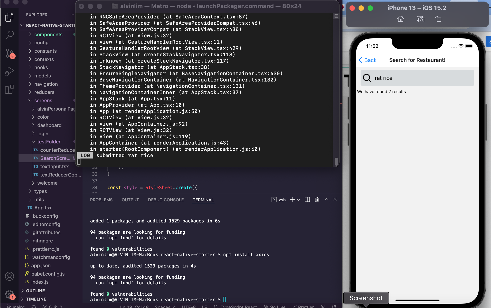
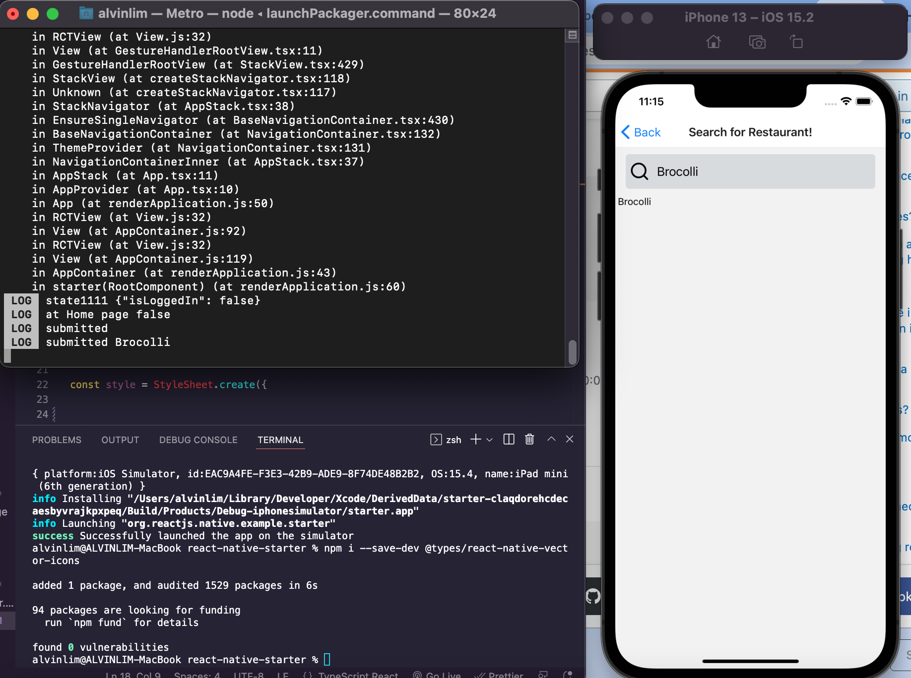
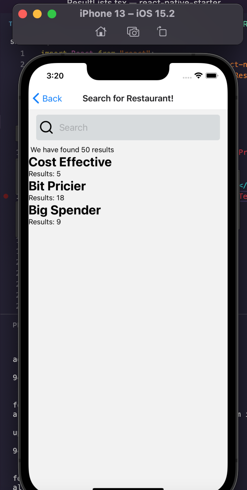

 

<h3 align="center">Learning Journal 06 May 2022</h3>

<!-- TABLE OF CONTENTS -->

  
Table of Contents

  <ul>
    <li><a href="#what-did-i-learn-today">What did I learn today?</a></li>
    <li><a href="#any-issues-i-encounter">Any issues I encounter?</a></li>
    <li><a href="#snippets">Snippets</a></li>
    <li><a href="#acknowledgments">Acknowledgments</a></li>
    <li><a href="#resource-links">Resource Links</a></li>
  </ul>

<!-- ABOUT THE PROJECT -->
## What did I learn today? ##
----
<!-- Type what you learnt here -->

**Resolving my Build error**

  - Jan sent me her initial Info.Plist to replace with my existing ones. And Willy also helped me by getting me to comment off the `nvm` parts in the `find_node.sh` file. there could be some issue with my node packages versioning.

  - Afterwards, I went to add the list of fonts into the Info.plist at the end and `cd ios && pod install`

  - I rebuilt the app after I `cd ..` back to root folder.

**useEffects Hook**

  - The hook is telling React to perform the action specifies in the body after rendering. In order not to make unnecessary rendering, we could specify how we want the useEffect to render based on the second arguments.

  - *useEffect 2nd argument will determine how many time the component will rerender*

  

**Naming Conventions**

  - for custom hooks, use naming convention like useXxxx.tsx or useXxxx.js

**For the import of the custom Hooks**

  - When u wish to return a set of values or functions that is needed in the screen, at the last line input as such:

  `return [ searchApi, results, errorMessage ] as const`

  - this is so that when u tsc, u want to const the types it is in the hooks. So when u are using in the screen tsx, it will retain in its original type and not be inferred as otherwise. [Source](https://stackoverflow.com/a/65680619)

  
## Any issues I encounter? ##
----
<!-- Type Your Issues Faced today Here -->

## Snippets ##

*First Search Screen with States*

*Linking Up with Yelp API*

*Showing input when user press enter*

*Filter By Pricing*

<!-- ACKNOWLEDGMENTS -->
## Acknowledgments ##
----
* [Anya](https://github.com/huanganya/react-native-starter)
* Janan
* Othneil Drew for this ReadMe template

<!-- Resource Links -->
## Resource Links ##
----
* [Day 21: React Native State Management](https://docs.google.com/document/d/1UWVxJki7XZkQu7VEFATDnJppBAa7iXlfxPsPXUMhZts/edit)

* [Understand React Native with Hooks, Context, and React Navigation.](https://nlbsg.udemy.com/course/the-complete-react-native-and-redux-course/learn/lecture/15706480#overview)

* [This expression is not callable. Not all constituents of type 'string | ((searchTerm: string) => Promise<void>) | []' are callable](https://stackoverflow.com/a/65680619)

(<a href="#top">Back to top</a>)

