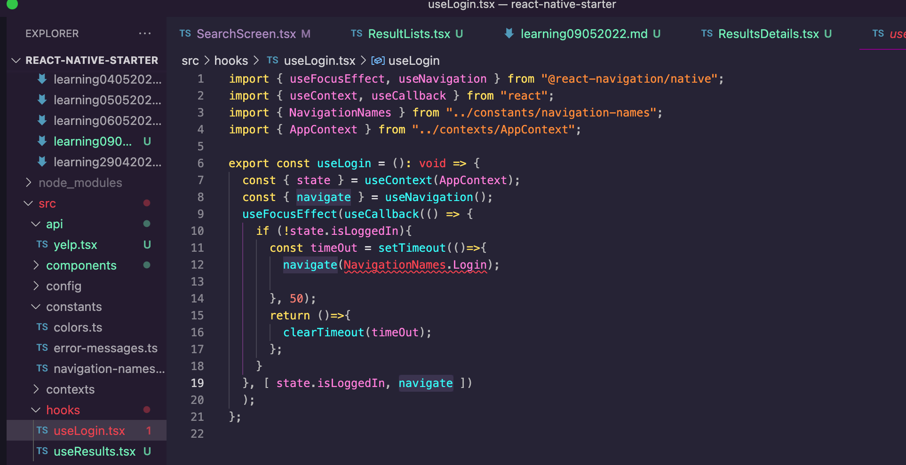
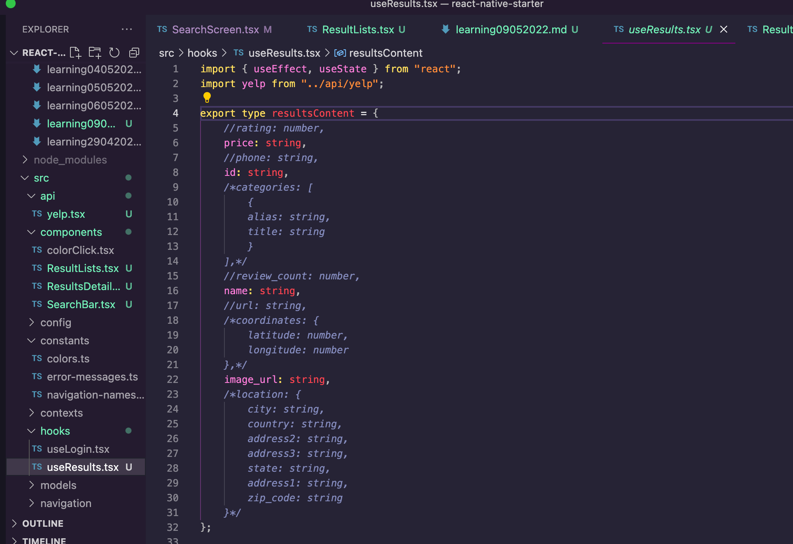
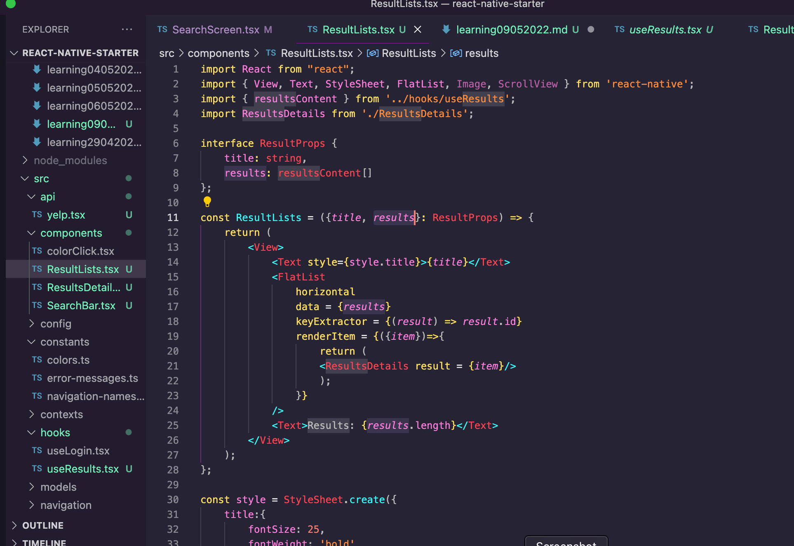
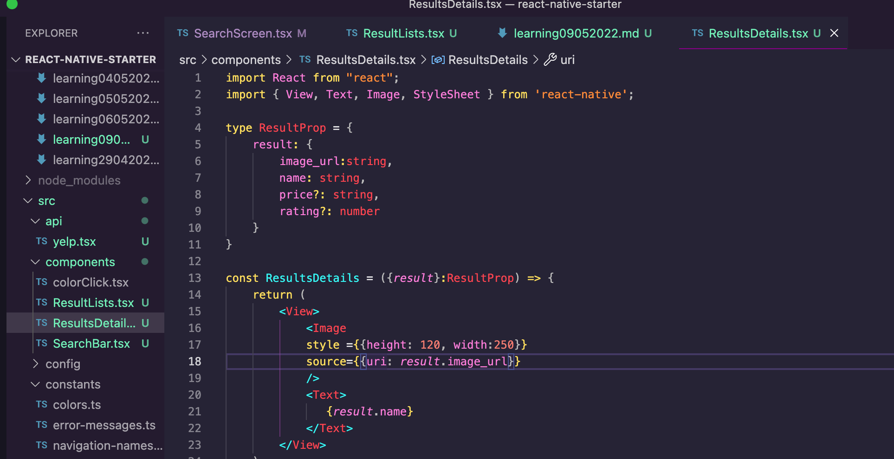
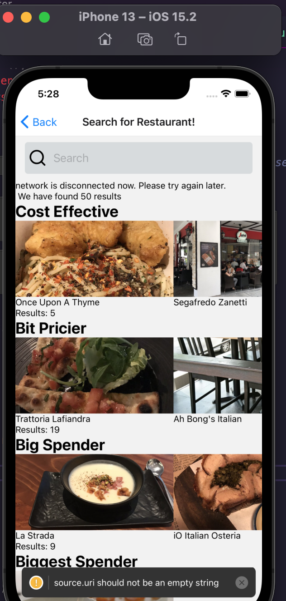

 

<h3 align="center">Learning Journal 09 May 2022</h3>

<!-- TABLE OF CONTENTS -->

  
Table of Contents

  <ul>
    <li><a href="#what-did-i-learn-today">What did I learn today?</a></li>
    <li><a href="#any-issues-i-encounter">Any issues I encounter?</a></li>
    <li><a href="#snippets">Snippets</a></li>
    <li><a href="#acknowledgments">Acknowledgments</a></li>
    <li><a href="#resource-links">Resource Links</a></li>
  </ul>

<!-- ABOUT THE PROJECT -->
## What did I learn today? ##
----
<!-- Type what you learnt here -->

**Why do we create Custom Hooks?**

  ***Side Note:***
  *A custom hook is a JS function that takes on a name of useXxxxxx and may call on other hooks.*  

  1. First, this way we could share the logic for a function in which we would wish to implement in multiple screens without duplicating the codes.

  2. When 2 components are using the custom hook, they are not sharing the same state. They are only sharing the *stateful logic* of the hook.

  *My take on the useLogin Hook*
  
  the useLogin Hook is used to set in a routing mechanism to check if the app is logged in. If it is not log in, it will prompt you to the log in screen.
  Else, if log in, it will change the log in status on the log in page

## Any issues I encounter? ##
----
<!-- Type Your Issues Faced today Here -->

**useLogin Hook**

- I am not very sure what does the `navigate` does at the bottom of the code (line 19)

**Unable to fully understand the Props System**

- I am unable to fully understand the prop system as well as the type declaration.

- In my useResult Hook, I have defined the resultContent individually based on the data type.

- In which I have imported and to be used into my `ResultList.tsx` for the results typing declaration

- As I followed on to the video, as he created a `ResultDetail.tsx` for the individual businesses details, he destructured the `props` using a new term `result`. So I tried to do that and there is an implicit any error message. Now I have defined it using the same definition as the ones I did in `useResult`. I tried to import the type but I am not able to clear the error messages.

## Snippets ##

*useNetInfo*

<!-- ACKNOWLEDGMENTS -->
## Acknowledgments ##
----
* [Anya](https://github.com/huanganya/react-native-starter)
* Janan
* Othneil Drew for this ReadMe template

<!-- Resource Links -->
## Resource Links ##
----
* [Day 22: React Native State Management](https://docs.google.com/document/d/123eVR8bzWPcu7QMGD_EaYjEXxX1hnGGOco74zLXDURQ/edit#)

* [Understand React Native with Hooks, Context, and React Navigation.](https://nlbsg.udemy.com/course/the-complete-react-native-and-redux-course/learn/lecture/15706480#overview)

* [Hooks API Reference](https://reactjs.org/docs/hooks-reference.html)

* [Custom Hooks](https://reactjs.org/docs/hooks-custom.html)

(<a href="#top">Back to top</a>)

