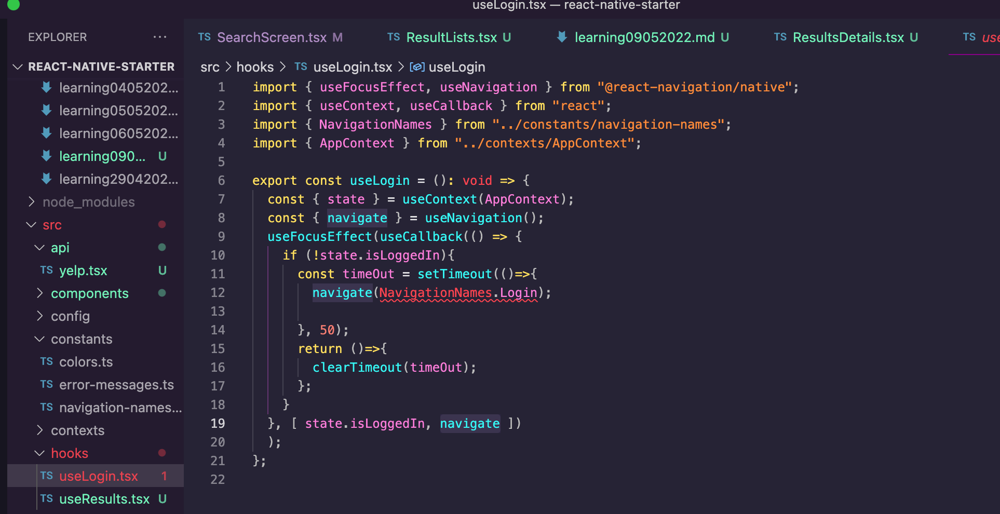

<div id="top"></div>

<br />

<h3 align="center">Learning Journal 10 May 2022</h3>

<!-- TABLE OF CONTENTS -->
<details>
  <summary>Table of Contents</summary>
  <ul>
    <li><a href="#what-did-i-learn-today">What did I learn today?</a></li>
    <li><a href="#any-issues-i-encounter">Any issues I encounter?</a></li>
    <li><a href="#snippets">Snippets</a></li>
    <li><a href="#acknowledgments">Acknowledgments</a></li>
    <li><a href="#resource-links">Resource Links</a></li>
  </ul>
</details>

<!-- ABOUT THE PROJECT -->
## What did I learn today? ##
----
<!-- Type what you learnt here -->
**CSS Note**

  - When adding `flex: 1` to the most parent wrapping element, you are telling the element to only use the actual visible screen estate to display.

    - *Do this when some of your contents got cut off by the screen*

  - Alternatively, we could replace the parent `view` element with an empty element `<>` `</>`. This is to let React know that not to let the content go out of the screen

**Destructuring**

  - Destructuring is very complicated to me, thanks to Janan explanation, I am able to understand better now. Destructuring is like **extracting the properties of the object**, so that you can access this properties easier.

  - For example, a destructured props could be accessed using props right away, (i.e. `imageSource`, `title`, `rating`, `review`)
  
  ```const ResultsDetails = ({title, imageSource, rating, review}:ResultProp) => {                       return (                                                                                            <View style = {style.container}>                                                                   <Image style = {style.image} source={{uri: imageSource}}/>                                          <Text style = {style.title}>{title}</Text>                                                          <Text>{rating} stars, {review} ratings</Text>                                                           </View>)}```

  - If there is no destructuring in line 1, I would have to code as `props.title` to access the properties.

**Recapping on the Props System**

  - create a reusable component, `export` so that your screen could `import` and access it.

  - Then in your screen pass in the `props` of this component in which the component script will then access these props and format the output using JSX.

**useNavigation Hook**

  - the useNavigation hook allows you to access the `navigation` object props. [Source](https://reactnavigation.org/docs/use-navigation/)

  - As I could not find the withNavigation() so I checked with Willy and he pointed me to this hook.

  - Upon applying the hook, there is a type declaration error highlighted by TypeScript.

  - I went to search on [StackOverflow](https://stackoverflow.com/a/64296407) to check on how others fixed this. So this solution's focus is to declare what this Navigation object will require in this case. In our case, `navigation` will call on function `navigate` based on a parameter `destination` which is of a `string`. And for the return type of this function, I stated it to be `undefined` this is to follow the `RootStackParamList`. So now we need to call on the `useNavigation` to initialise the variable `navigation` with the property of a React Navigation props.

  ` const navigation: Navigation = useNavigation(); `

  - And then we will then be able to use the functionality of React's Navigation, my code to access is as follows:

  `<TouchableOpacity onPress={() => navigation.navigate('ResultsShowScreen')}>`

## Any issues I encounter? ##
----
<!-- Type Your Issues Faced today Here -->

**useLogin Hook**

- I am not very sure what does the `navigate` does at the bottom of the code (line 19)



**declare type for `navigation` props**


## Snippets ##

<!-- ACKNOWLEDGMENTS -->
## Acknowledgments ##
----
* [Anya](https://github.com/huanganya/react-native-starter)
* Janan
* Othneil Drew for this ReadMe template

<!-- Resource Links -->
## Resource Links ##
----
* [Day 23: React Native State Management](https://docs.google.com/document/d/1gi-b9OeYKEOQ1KTVcfV8wCKC9yZQJp9UUGYFchH3lRA/edit)

* [Day 24: React Native Restaurant App - Navigation to Single Result](https://docs.google.com/document/d/1YHYjEg00tK1dWpwxV0v2FefcmLr-A1OfKVrpPw2DwDU/edit#heading=h.e9flh4v041dw)

* [Understand React Native with Hooks, Context, and React Navigation.](https://nlbsg.udemy.com/course/the-complete-react-native-and-redux-course/learn/lecture/15706480#overview)

* [Hooks API Reference](https://reactjs.org/docs/hooks-reference.html)

* [Custom Hooks](https://reactjs.org/docs/hooks-custom.html)

<p align="right">(<a href="#top">Back to top</a>)</p>

