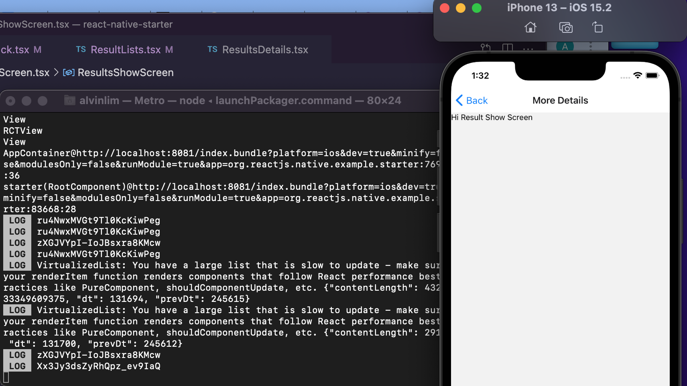
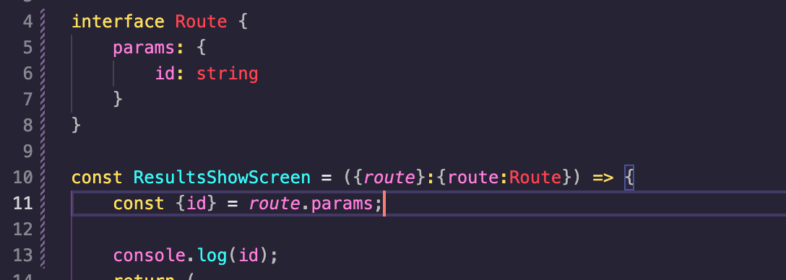
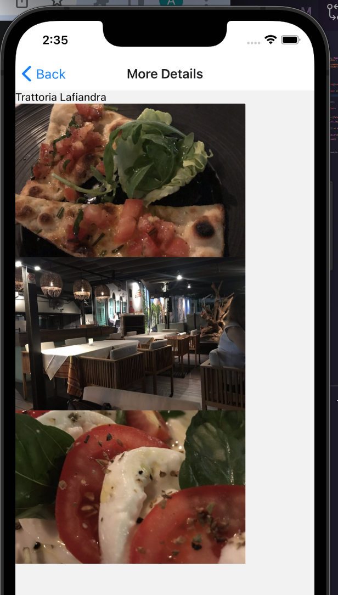

 

<h3 align="center">Learning Journal 11 May 2022</h3>

<!-- TABLE OF CONTENTS -->

  
Table of Contents

  <ul>
    <li><a href="#what-did-i-learn-today">What did I learn today?</a></li>
    <li><a href="#any-issues-i-encounter">Any issues I encounter?</a></li>
    <li><a href="#snippets">Snippets</a></li>
    <li><a href="#acknowledgments">Acknowledgments</a></li>
    <li><a href="#resource-links">Resource Links</a></li>
  </ul>

<!-- ABOUT THE PROJECT -->
## What did I learn today? ##
----
<!-- Type what you learnt here -->
**Passing Params to Routes**

*[Source](https://reactnavigation.org/docs/params/)*

There are various ways to pass the params to your routes, and this ways are based on your react navigation version. As the Udemy video is using an older version, I could not follow his way to pass in the param to be accepted in another screen. 

I went to the docs and [StackOverflow](https://stackoverflow.com/questions/60769220/typeerror-props-navigation-getparam-is-not-a-function-inprops-navigation-get) for more insights on how can I pass params.

It works fine, my console is showing the different ID based on the restaurants I clicked into.

*Code Snippet*

Whenever we are rendering an object as state, the initial value should be `null`. > meaning we have not yet fetched any data.

## Any issues I encounter? ##
----
<!-- Type Your Issues Faced today Here -->

## Snippets ##

**Showing the Images of the Selected Restaurant**

<!-- ACKNOWLEDGMENTS -->
## Acknowledgments ##
----
* [Anya](https://github.com/huanganya/react-native-starter)
* Janan
* Othneil Drew for this ReadMe template

<!-- Resource Links -->
## Resource Links ##
----

* [Day 24: React Native Restaurant App - Navigation to Single Result](https://docs.google.com/document/d/1YHYjEg00tK1dWpwxV0v2FefcmLr-A1OfKVrpPw2DwDU/edit#heading=h.e9flh4v041dw)

* [Day 25: React Native Restaurant App - Navigation to Single Result](https://docs.google.com/document/d/1r1bZSt7AudY1e2cr7j6yAAILupXcYy-QbWT_WXlOefU/edit)

* [Understand React Native with Hooks, Context, and React Navigation.](https://nlbsg.udemy.com/course/the-complete-react-native-and-redux-course/learn/lecture/15706480#overview)

* [Hooks API Reference](https://reactjs.org/docs/hooks-reference.html)

* [Custom Hooks](https://reactjs.org/docs/hooks-custom.html)

(<a href="#top">Back to top</a>)

