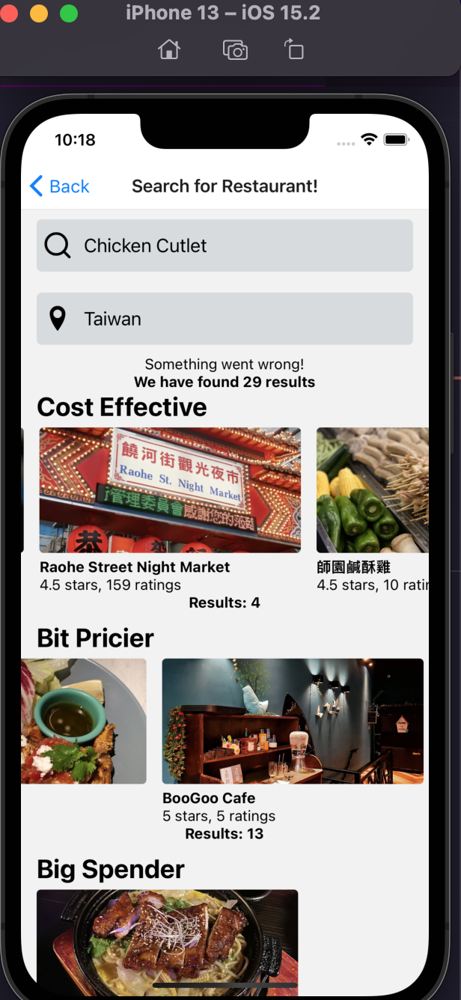

 

<h3 align="center">Learning Journal 13 May 2022</h3>

<!-- TABLE OF CONTENTS -->

  
Table of Contents

  <ul>
    <li><a href="#what-did-i-learn-today">What did I learn today?</a></li>
    <li><a href="#acknowledgments">Acknowledgments</a></li>
    <li><a href="#resource-links">Resource Links</a></li>
  </ul>

<!-- ABOUT THE PROJECT -->
## What did I learn today? ##
----
<!-- Type what you learnt here -->

- **[x] Trying to do up the location searchbar**

  I have tried to do the dynamic search bar for location, as I understand that one of the parameter is requiring location or latitude and longitude. Hence, I was a little confused on the requirement of the dynamic location searchbar.

  But later on, I think I can create another location search bar component which will have a state based on user's input then I will transfer the state over to the location parameter in the original searchbar component.

  ***Update on 13May2022*** 

  I have created another component for the searchLocationBar and need to do some edit in the `searchApi` body as `location` param has been stated as a country by us. Hence, we could create a `location state` such that it would accept user's input in the `searchLocationBar` and then use this state to use as the `location` param. This could help us to keep the search function dynamic based on location 

    ***Snippet of the simulator***

    *Screenshot*

    

    *Short Demo*

    

- **[] Doing more exercises for TypeScript**

  I realised that I am not very proficient in TypeScript, so I have to spend time to strengthen the foundation of TypeScript. And I am trying to improve on my typing by doing the Exercises on [Exercism.org](https://exercism.org/tracks/typescript/exercises). It is not perfect in their questions clarity but it is free and it can be done using their online editor.

  ***Update as of 13 May 2022***

  Still practising during free time, keep trying to be proficient and not to be overconfident.

- **[] React Context**

  - **four steps to using React context**

    1. Create Context, `createContext()`
    
    2. Wrap Context provider around the component
    
    3. Insert value on Context Provider using `value`

    4. Read the value within any component using context consumer

  - **Why use Context**
    
    - For props that are required by many components in an application, it is troublesome to pass these props one by one.

    - it is ideal for data that does not change often

    - it allows consumption of data easier

  ***Updates on 13 May 2022***

    - Still continue to follow through Udemy guides while trying to apply the types at the same time. 

    - the rationale behind wrapping the context provider around the `<App />` I need to understand more.

<!-- ACKNOWLEDGMENTS -->
## Acknowledgments ##
----
* [Anya](https://github.com/huanganya/react-native-starter)
* Janan
* Othneil Drew for this ReadMe template

<!-- Resource Links -->
## Resource Links ##
----

* [Day 24: React Native Restaurant App - Navigation to Single Result](https://docs.google.com/document/d/1YHYjEg00tK1dWpwxV0v2FefcmLr-A1OfKVrpPw2DwDU/edit#heading=h.e9flh4v041dw)

* [Day 25: React Native Restaurant App - Navigation to Single Result](https://docs.google.com/document/d/1r1bZSt7AudY1e2cr7j6yAAILupXcYy-QbWT_WXlOefU/edit)

* [Understand React Native with Hooks, Context, and React Navigation.](https://nlbsg.udemy.com/course/the-complete-react-native-and-redux-course/learn/lecture/15706480#overview)

* [Hooks API Reference](https://reactjs.org/docs/hooks-reference.html)

* [Custom Hooks](https://reactjs.org/docs/hooks-custom.html)

* [React Context for Beginners – The Complete Guide (2021)](https://www.freecodecamp.org/news/react-context-for-beginners/#:~:text=React%20context%20caveats-,What%20is%20React%20context%3F,across%20our%20components%20more%20easily.)

(<a href="#top">Back to top</a>)

