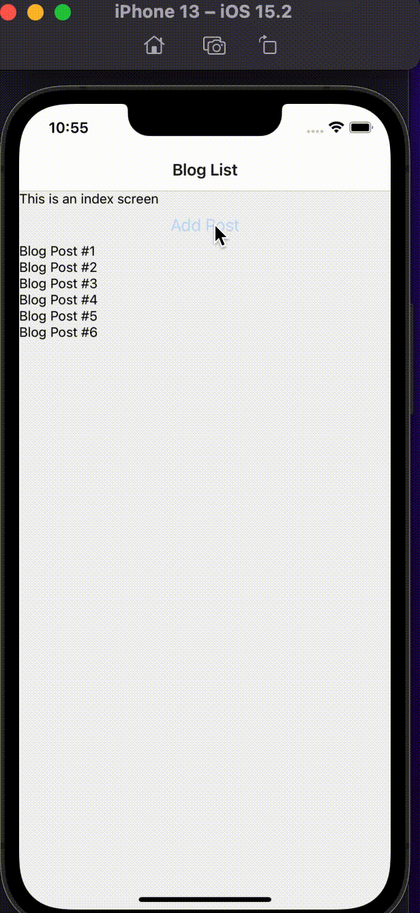

<div id="top"></div>

<br />

<h3 align="center">Learning Journal 16 & 17 May 2022</h3>

<!-- TABLE OF CONTENTS -->
<details>
  <summary>Table of Contents</summary>
  <ul>
    <li><a href="#what-did-i-learn-today">What did I learn today?</a></li>
    <li><a href="#acknowledgments">Acknowledgments</a></li>
    <li><a href="#resource-links">Resource Links</a></li>
  </ul>
</details>

<!-- ABOUT THE PROJECT -->
## What did I learn today? ##
----
<!-- Type what you learnt here -->

**Fixing up the Context Portion for usage in Blog App**

I rewatched the video to try to catch if I missed any details or concept.

*Step 1*

We will use the `createContext(defaultValue)` function from React,

*Step 2*

Create a Provider for the context, in this case `BlogProvider` this will be needed for us to wrap around the `children`                                   ```<BlogProvider value>                                                       {children}                                                                            </BlogProvider>```

The `value` is the data which you would wish to share with your components.

*Step 3*

In the component screen which you would wish to use the context, 

`import {useContext} from 'react';` this hook is to allow your screen to be able to access the data you input in your `value` props earlier in the `<BlogProvider>`.

Example:
`const value = useContext(BlogContext);`

*Main Concept in the Context so far*

You wish to pass in a data in your context, so that you could pass it into the children without duplicating the codes multiple times. 

*When you want to display an object*

Use the Flatlist element instead of Text as Text is only meant primitive data types instead of objects 

## Snippets ##

**BlogPost Title Rendering**

*Short Demo*



<!-- ACKNOWLEDGMENTS -->
## Acknowledgments ##
----
* [Anya](https://github.com/huanganya/react-native-starter)
* Janan
* Othneil Drew for this ReadMe template

<!-- Resource Links -->
## Resource Links ##
----

* [Day 26: Blog App: React Native Context with useState](https://docs.google.com/document/d/1obVGcsmgY1SHk4I15jZEN0x2vCZH6x1GlTUiUmHw-tY/edit#)

* [Understand React Native with Hooks, Context, and React Navigation.](https://nlbsg.udemy.com/course/the-complete-react-native-and-redux-course/learn/lecture/15706480#overview)

* [Hooks API Reference](https://reactjs.org/docs/hooks-reference.html)

* [Custom Hooks](https://reactjs.org/docs/hooks-custom.html)

* [React Context for Beginners – The Complete Guide (2021)](https://www.freecodecamp.org/news/react-context-for-beginners/#:~:text=React%20context%20caveats-,What%20is%20React%20context%3F,across%20our%20components%20more%20easily.)

<p align="right">(<a href="#top">Back to top</a>)</p>

