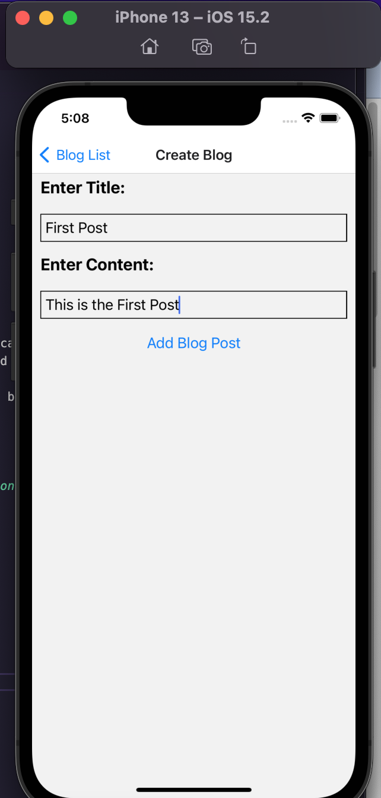
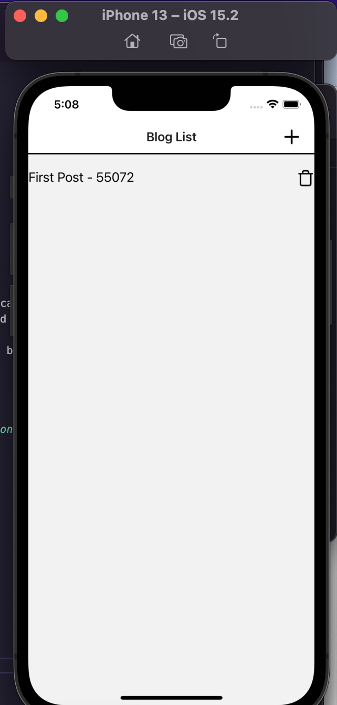
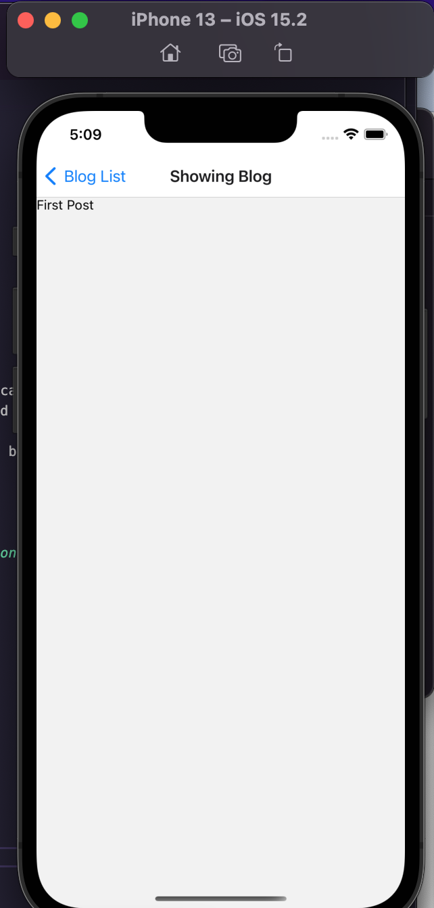

<div id="top"></div>

<br />

<h3 align="center">Learning Journal 18 May 2022</h3>

<!-- TABLE OF CONTENTS -->
<details>
  <summary>Table of Contents</summary>
  <ul>
    <li><a href="#what-did-i-learn-today">What did I learn today?</a></li>
    <li><a href="#acknowledgments">Acknowledgments</a></li>
    <li><a href="#resource-links">Resource Links</a></li>
  </ul>
</details>

<!-- ABOUT THE PROJECT -->
## What did I learn today? ##
----
<!-- Type what you learnt here -->

**Blog App**

1. Creating a right header button using the `headerRight` option in the `App.tsx` file instead of the `IndexScreen` file. this is because the headerRight is deprecated in `navigationOption`.

So in `App.tsx` we have to locate the `<Stack.Screen>` for `IndexScreen` and add in a `navigation` params in the `options` props. 

Example:

```<Stack.Screen name='Index' component={IndexScreen}                                                             options = {({navigation}) => ({  title: 'Blog List', headerRight: () => (                                       <TouchableOpacity onPress={() => navigation.navigate('Create')}>                                                      <Icon name='plus' size={30}/>                                                                                         </TouchableOpacity>                                                                                                     ),                                                                                                                    })}/>```

2. **Assigning a unique id for each blog post created using a formula:**

`id: Math.floor(Math.random()*99999)`

3. Creating a delete post function by clicking the trash icon of the blogpost

  **Creating a delete function:**

  ```const deleteBlogPost = (dispatch) => {                                                                         return (id) => {                                                                                                  dispatch ({                                                                                                                 type: 'delete_blogpost', payload: id                                                                                  }                                                                                                                     )}};```

  **Adding a case into the reducer:** 
  This function meant that the state array will be iterated through based on the callback function stated, 
    1. so if `blogPost.id !== action.payload` is true, this blogpost will be added into our new state array. 
    
    2. It means to say if I click on the trash icon, the function will see if the blog id will be equal to the assigned item.id of that trash icon i clicked. 
    
    3. If it matches, then the post will be deleted

  `case 'delete_blogpost': return state.filter((blogPost) => blogPost.id !== action.payload);`


## Snippets ##

**BlogPost App**

*Create Blog*



*Index Page*



*Blog Screen*




<!-- ACKNOWLEDGMENTS -->
## Acknowledgments ##
----
* [Anya](https://github.com/huanganya/react-native-starter)
* Janan
* Othneil Drew for this ReadMe template

<!-- Resource Links -->
## Resource Links ##
----

* [Day 26: Blog App: React Native Context with useState](https://docs.google.com/document/d/1obVGcsmgY1SHk4I15jZEN0x2vCZH6x1GlTUiUmHw-tY/edit#)

* [Understand React Native with Hooks, Context, and React Navigation.](https://nlbsg.udemy.com/course/the-complete-react-native-and-redux-course/learn/lecture/15706480#overview)

* [Hooks API Reference](https://reactjs.org/docs/hooks-reference.html)

* [Custom Hooks](https://reactjs.org/docs/hooks-custom.html)

* [React Context for Beginners – The Complete Guide (2021)](https://www.freecodecamp.org/news/react-context-for-beginners/#:~:text=React%20context%20caveats-,What%20is%20React%20context%3F,across%20our%20components%20more%20easily.)

* [Navigation undefined - TypeError: undefined is not an object (evaluating 'navigation.navigate')](https://stackoverflow.com/questions/66293379/navigation-undefined-typeerror-undefined-is-not-an-object-evaluating-naviga)

<p align="right">(<a href="#top">Back to top</a>)</p>

