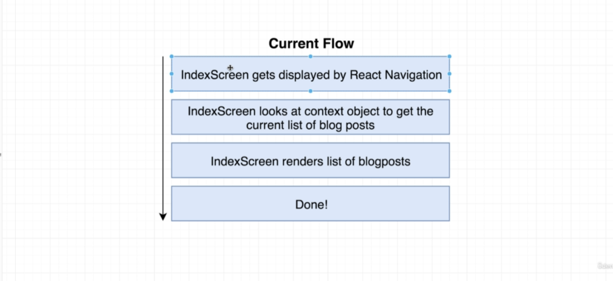
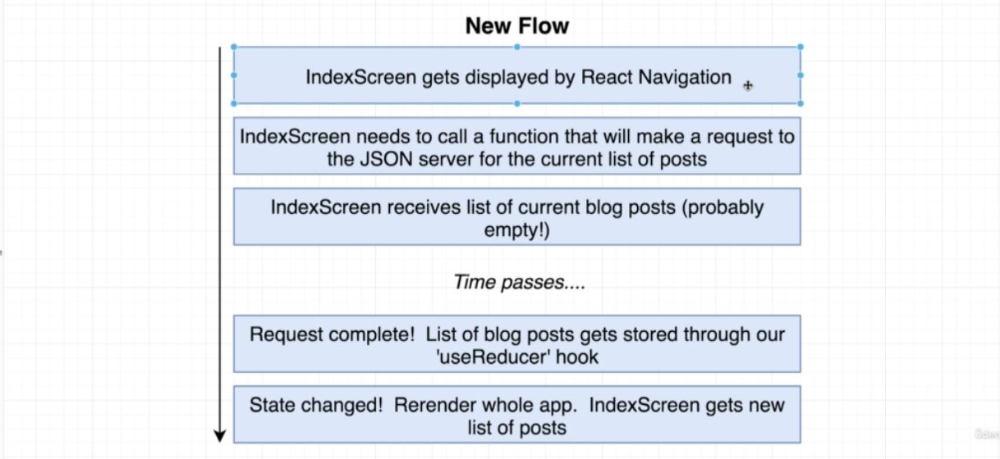
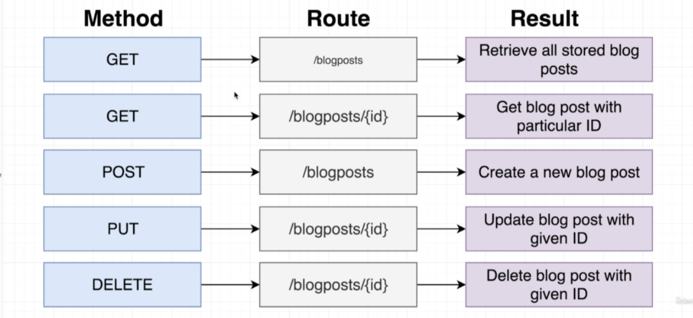

<div id="top"></div>

<br />

<h3 align="center">Learning Journal 20 May 2022</h3>

<!-- TABLE OF CONTENTS -->
<details>
  <summary>Table of Contents</summary>
  <ul>
    <li><a href="#what-did-i-learn-today">What did I learn today?</a></li>
    <li><a href="#acknowledgments">Acknowledgments</a></li>
    <li><a href="#resource-links">Resource Links</a></li>
  </ul>
</details>

<!-- ABOUT THE PROJECT -->
## What did I learn today? ##
----
<!-- Type what you learnt here -->

**Blog App**

**Inputting API into the context to link to JSON database**

----

*Note: JSON will create an ID for our data*

1. Creating a new project folder for the JSON server

2. cd to projectfolder and `npm install json-server`

3. Create a `db.json` file in the project root dir

4. insert the code into the `db.json` file: 

```{                                                                                                                    "blogposts":[]                                                                                                        }```

5. In the `package.json`, under `scripts:` type: 

`"db": "json-server -w db.json", `

6. Open a new terminal, type: `npm run db`

7. `npm install axios` in our blog app root folder

8. create an `API` folder in src and `jsonServer.ts` in the `API` folder

9. ```import axios from 'axios';                                                                                export default axios.create ({baseURL: 'http://localhost:3000/'});```

10. I am using localhost:3000 as i did not use a phone to simulate hence, i did not configure ngrok

11. at `BlogContext`: **Fetching method**
  ```const getBlogPost = dispatch => { return async () => {                                                       const response = await jsonServer.get('/blogposts');                                                                dispatch({ type: 'get_blogposts', payload: response.data});                                                         };                                                                                                                  };```

12. add in the getBlogPost into the reducer functions

13. We do not need to return `[...state]` as we expect the data we fetch from the API to be the whole source of truth.

14. We want to show a post in the indexScreen but we do not want it to go into an infinite loop by calling the getBlogPost in the function. We can use the `useEffect()` hook to ensure it run once at the start when the app renders.

15. Creating post we will use `jsonServer.post` in the `addBlogPost` function in `blogContext`

16. As we want to navigate back to the index screen after adding a post, we will use the navigation.navigate() in the callback for the onSubmit in addBlogPost

17. and in the `useEffect` hook earlier, we will pass a second body of code, `...navigate('focus',()=>{getBlogPost()}); }, []);` this will ensure the index screen will display the latest post u added each time u click the add post button.

**Difficulties**

I'm still trying to convert the blog app into typescript as i find it hard to catch up with the Udemy tutorial while trying to code the codes in Typescript. Will persist on the conversion!

## Snippets ##

**How the data are flowing now**



**How it should Flow**



**API Method**




<!-- ACKNOWLEDGMENTS -->
## Acknowledgments ##
----
* [Anya](https://github.com/huanganya/react-native-starter)
* Janan
* Othneil Drew for this ReadMe template

<!-- Resource Links -->
## Resource Links ##
----

* [Day 26: Blog App: React Native Context with useState](https://docs.google.com/document/d/1obVGcsmgY1SHk4I15jZEN0x2vCZH6x1GlTUiUmHw-tY/edit#)

* [Understand React Native with Hooks, Context, and React Navigation.](https://nlbsg.udemy.com/course/the-complete-react-native-and-redux-course/learn/lecture/15706480#overview)

* [Hooks API Reference](https://reactjs.org/docs/hooks-reference.html)

* [Custom Hooks](https://reactjs.org/docs/hooks-custom.html)

* [React Context for Beginners – The Complete Guide (2021)](https://www.freecodecamp.org/news/react-context-for-beginners/#:~:text=React%20context%20caveats-,What%20is%20React%20context%3F,across%20our%20components%20more%20easily.)

* [Navigation undefined - TypeError: undefined is not an object (evaluating 'navigation.navigate')](https://stackoverflow.com/questions/66293379/navigation-undefined-typeerror-undefined-is-not-an-object-evaluating-naviga)

<p align="right">(<a href="#top">Back to top</a>)</p>

