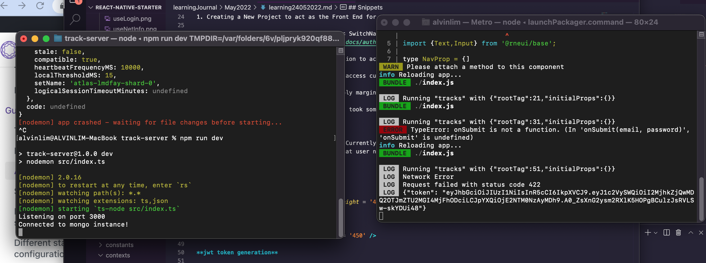

 

<h3 align="center">Learning Journal 24 & 25 May 2022</h3>

<!-- TABLE OF CONTENTS -->

  
Table of Contents

  <ul>
    <li><a href="#what-did-i-learn-today">What did I learn today?</a></li>
    <li><a href="#acknowledgments">Acknowledgments</a></li>
    <li><a href="#resource-links">Resource Links</a></li>
  </ul>

<!-- ABOUT THE PROJECT -->
## What did I learn today? ##
----
<!-- Type what you learnt here -->

### Setting Up the Front End App to link up with the Back End ###

1. Creating a New Project to act as the Front End for the Tracker App

2. Have to configure the Navigation Flow, as SwitchNavigation has been deprecated, have to study the Auth Flow in the [Documentation](https://reactnavigation.org/docs/auth-flow)

3. Spent some time to configured the navigation to achieve the same outcome as the tutorial

4. import `react-native-element` library to access customisable components elements 

5. create a helper component `Spacer` to apply margin spacing in between elements

6. Applying Recoil into the context part, it took some time as I am still trying to familiarise with the Recoil

7. I have applied Recoil into the Blog App

8. Still in progress with the Tracking App: Currently at async storage which is needed for us to store the JSONWebToken of the user in the device so that user need not log in each time they exit and open the app.

## Snippets ##

**Managed to post a signUp**

<!-- ACKNOWLEDGMENTS -->
## Acknowledgments ##
----
* [Anya](https://github.com/huanganya/react-native-starter)
* Janan
* Othneil Drew for this ReadMe template

<!-- Resource Links -->
## Resource Links ##
----

* [Day 29-33: Tracker App](https://docs.google.com/document/d/1obVGcsmgY1SHk4I15jZEN0x2vCZH6x1GlTUiUmHw-tY/edit#)

* [Recoil](https://recoiljs.org/docs/introduction/getting-started)

* [Understand React Native with Hooks, Context, and React Navigation.](https://nlbsg.udemy.com/course/the-complete-react-native-and-redux-course/learn/lecture/15706480#overview)

* [Hooks API Reference](https://reactjs.org/docs/hooks-reference.html)

* [Custom Hooks](https://reactjs.org/docs/hooks-custom.html)

* [React Context for Beginners – The Complete Guide (2021)](https://www.freecodecamp.org/news/react-context-for-beginners/#:~:text=React%20context%20caveats-,What%20is%20React%20context%3F,across%20our%20components%20more%20easily.)

* [Navigation undefined - TypeError: undefined is not an object (evaluating 'navigation.navigate')](https://stackoverflow.com/questions/66293379/navigation-undefined-typeerror-undefined-is-not-an-object-evaluating-naviga)

* [How to convert ExpressJS to TS](https://blog.phillipninan.com/how-to-convert-expressjs-to-typescript)

(<a href="#top">Back to top</a>)

