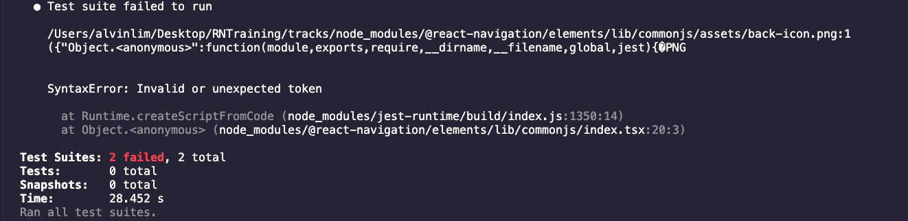
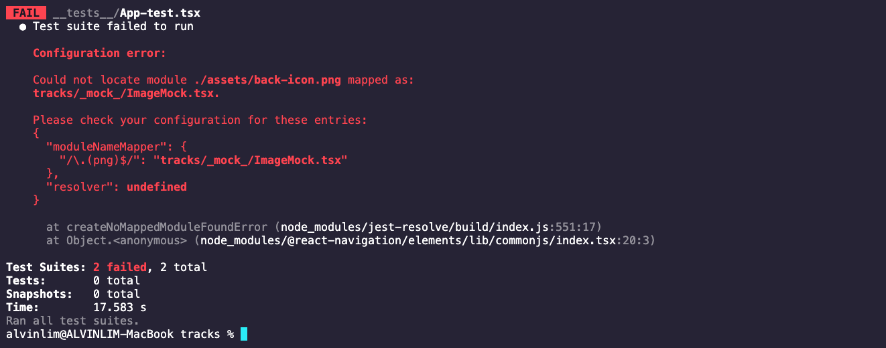
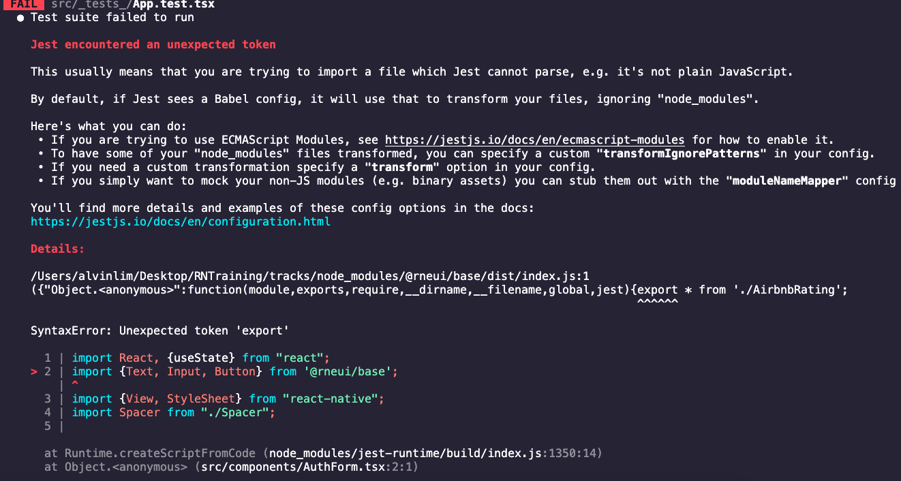
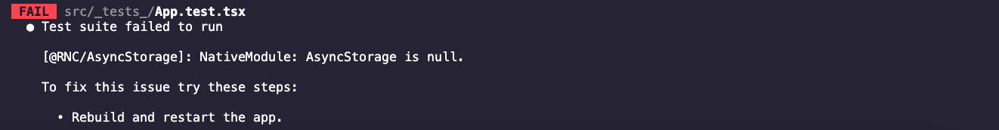
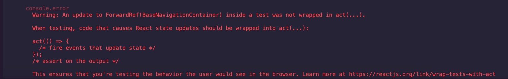

 

<h3 align="center">Learning Journal 31 May 2022</h3>

<!-- TABLE OF CONTENTS -->

  
Table of Contents

  <ul>
    <li><a href="#what-did-i-learn-today">What did I learn today?</a></li>
    <li><a href="#acknowledgments">Acknowledgments</a></li>
    <li><a href="#resource-links">Resource Links</a></li>
  </ul>

<!-- ABOUT THE PROJECT -->
## What did I learn today? ##
----
<!-- Type what you learnt here -->

### Learning about Unit Testing ###

- Things to install and prepare before testing: 

  1. `npm install --save-dev @testing-library/react-native`

  2. `npm install --save-dev @testing-library/jest-native`

  3. In `package.json`, under `jest`, add: `"setupFilesAfterEnv": ["@testing-library/jest-native/extend-expect"]`

- I am attempting to create a unit testing for the Parent Component; and encountered some issue:

  **Error Message 1**

  

  [Reference](https://stackoverflow.com/questions/70506768/how-can-i-test-react-native-components-that-includes-pngs-images-with-jest)

  **Error Message 2**

  

  *Note: Ensure that the `moduleNameMapper` is added into the `package.json` and the directory is `"<rootDir>/_mock_/ImageMock.tsx"`. **DO NOT** change the `<rootDir>`*

- Third Error encountered after I amended the directory:

  

  [Resolution 1 taken](https://stackoverflow.com/q/42260218)

  Another Error Showing afterwards:

  

  [Resolution 2 taken](https://www.reddit.com/r/reactnative/comments/tadkvb/nativemodule_asyncstorage_is_null_when_running/)

  *In `package.json`, under `jest` > `setupFilesAfterEnv` add in the directory to your setup file, for mine is : `<rootDir>/_mock_/jestSetupFile.js`*

- Test for Parent Component *Passed* but there's an console error:

  

<!-- ACKNOWLEDGMENTS -->
## Acknowledgments ##
----
* [Anya](https://github.com/huanganya/react-native-starter)
* Janan
* Othneil Drew for this ReadMe template

<!-- Resource Links -->
## Resource Links ##
----

* [React Testing Library](https://testing-library.com/docs/react-testing-library/intro/)

* [Guide to unit testing in React Native](https://blog.logrocket.com/unit-testing-react-native/#:~:text=Jest%20provides%20the%20testing%20environment,or%20a%20native%20mobile%20environment.)

* [callstack/react-native-testing-library](https://github.com/callstack/react-native-testing-library)

* [Understand React Native with Hooks, Context, and React Navigation.](https://nlbsg.udemy.com/course/the-complete-react-native-and-redux-course/learn/lecture/15706480#overview)

* [Hooks API Reference](https://reactjs.org/docs/hooks-reference.html)

* [Custom Hooks](https://reactjs.org/docs/hooks-custom.html)

* [React Context for Beginners – The Complete Guide (2021)](https://www.freecodecamp.org/news/react-context-for-beginners/#:~:text=React%20context%20caveats-,What%20is%20React%20context%3F,across%20our%20components%20more%20easily.)

* [Navigation undefined - TypeError: undefined is not an object (evaluating 'navigation.navigate')](https://stackoverflow.com/questions/66293379/navigation-undefined-typeerror-undefined-is-not-an-object-evaluating-naviga)

* [How to convert ExpressJS to TS](https://blog.phillipninan.com/how-to-convert-expressjs-to-typescript)

(<a href="#top">Back to top</a>)

